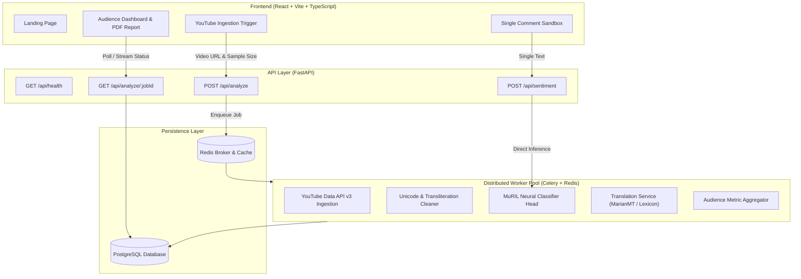

# Kollamo.ai — Malayalam-English Sentiment & Audience Intelligence

[](CHANGELOG.md)
[](https://github.com/sumedhacp/kollamo-ai-v2/actions/workflows/ci.yml)
[](LICENSE)
[](https://www.python.org/)
[](https://nodejs.org/)
[](https://www.typescriptlang.org/)
[](https://fastapi.tiangolo.com/)
[](docker-compose.yml)
[](https://pytorch.org/)
[](https://huggingface.co/google/muril-base-cased)

**Kollamo.ai** is an academic Master of Computer Applications (MCA) platform designed for fine-grained sentiment analysis and audience intelligence across regional Indian social web conversations. Specifically tailored for **Malayalam script**, **Manglish** (Romanized Malayalam), **English**, and **Malayalam-English code-mixed comments**, Kollamo.ai provides high-throughput ingestion of YouTube video comment threads, asynchronous neural classification, English translations for readability, and an executive audience intelligence dashboard.

> **Development Status**: **Release Ready (v1.0.0)**. All development phases (Phases 0 through 10) are complete, fully hardened, and verified with 295 automated tests, comprehensive security defenses, and empirical multi-scale benchmarks.

---


## 🏛️ System Architecture



---

## 🌟 Core Features

- **Multilingual & Code-Mixed NLP**: Robust sentiment analysis across pure Malayalam (`മലയാളം`), Manglish (`adipoli movie aayirunnu`), standard English, and complex code-mixed expressions.
- **Five-Class Sentiment Taxonomy**:
  - `Positive` — Admiration, praise, satisfaction.
  - `Negative` — Criticism, dissatisfaction, anger.
  - `Neutral` — Factual, informational, or objective queries.
  - `Mixed` — Co-occurring positive and negative sentiments.
  - `Unsupported` — Unintelligible text, pure noise, or unsupported languages.
- **Google MuRIL Foundation**: Powered by `google/muril-base-cased` fine-tuned for regional Dravidian code-mixed nuances with reproducible training checkpoints. No heuristic dictionaries or fake fallback predictions.
- **Official YouTube Data API v3 Ingestion**: Configurable comment extraction (50, 100, 250, 500, or ALL comments) supporting Most Liked, Newest, and Oldest sort modes with pagination and quota resilience.
- **Asynchronous Scalability**: Celery + Redis architecture ensuring zero UI freeze or FastAPI blocking during multi-thousand comment processing.
- **Audience Intelligence Dashboard**: Real-time distribution charts, sentiment vs. engagement analysis, Net Sentiment Approval Index (+60%), and multifaceted filtering.
- **Translation & Reporting**: Original comment preservation with English translations and publication-quality PDF report generation using `jsPDF` and ReportLab.

---

## 📂 Repository Structure

```text
kollamo-ai-v2/
├── .agents/                    # Antigravity agent configuration
├── .github/                    # CI/CD workflows and issue templates
├── backend/                    # FastAPI application & Celery workers
│   ├── alembic/                # Database migrations
│   ├── app/
│   │   ├── api/                # API routes and endpoints
│   │   ├── core/               # Configuration, security & rate limiting
│   │   ├── db/                 # Database engine & session management
│   │   ├── models/             # SQLAlchemy ORM models
│   │   ├── schemas/            # Pydantic v2 validation models
│   │   ├── services/           # Ingestion, sentiment, translation & reports
│   │   └── workers/            # Celery task definitions
│   ├── tests/                  # Backend unit & security & benchmark tests
│   └── requirements.txt        # Production Python dependencies
├── docker/                     # Production Dockerfiles (backend & worker)
├── docs/                       # Comprehensive documentation & ADRs
├── frontend/                   # React + Vite + TypeScript frontend
│   ├── e2e/                    # Playwright E2E journey specifications
│   ├── src/                    # UI components, pages, hooks, services, tests
│   ├── Dockerfile              # Multi-stage Nginx production container
│   ├── nginx.conf              # SPA reverse proxy configuration
│   └── package.json            # Node.js dependencies
├── ml/                         # ML training, data, models, and tests
├── docker-compose.yml          # Five-tier container orchestration
├── docker-compose.prod.yml     # Production stack with resource limits
├── .env.example                # Environment variable configuration template
├── AGENTS.md                   # Permanent engineering contract
├── CHANGELOG.md                # Version changelog
└── README.md                   # Project overview & documentation
```

---

## 🚀 Getting Started

### Option A: Quickstart via Docker Compose (Recommended)

Run the entire 5-tier production stack (PostgreSQL, Redis, FastAPI backend, Celery worker, and Nginx frontend) with a single command:

```bash
# 1. Clone repository & configure environment
git clone https://github.com/sumedhacp/kollamo-ai-v2.git
cd kollamo-ai-v2
cp .env.example .env

# 2. Build and run multi-container stack
docker compose up -d --build

# 3. Access the platform
# Web Application: http://localhost
# API Documentation: http://localhost:8000/docs
# Health Check: http://localhost:8000/api/health
```

---

### Option B: Local Development Setup

#### Prerequisites
- **Python**: 3.12 (or 3.10+)
- **Node.js**: 20+ (or 18+ LTS)
- **PostgreSQL**: 16+ (or SQLite local fallback)
- **Redis**: 7+

#### 1. Backend & ML Setup
```bash
python -m venv .venv
# Windows: .venv\Scripts\activate | Linux/macOS: source .venv/bin/activate
pip install -r backend/requirements.txt
pip install -r backend/requirements-dev.txt

# Run FastAPI server
uvicorn backend.app.main:app --reload --port 8000
```

#### 2. Frontend Setup
```bash
cd frontend
npm install
npm run dev
```

---

## 🧪 Testing & Verification

Kollamo.ai enforces a multi-tier testing pyramid with **295 automated tests passing (100%)**:

```bash
# 1. Run Backend Pytest Suite (177 tests)
python -m pytest backend/tests

# 2. Run ML Pipeline Pytest Suite (49 tests)
python -m pytest ml/tests

# 3. Run Dedicated Regression, Security & Performance Suites
python -m pytest backend/tests/test_phase9_regression.py backend/tests/test_phase9_security.py backend/tests/test_phase9_performance.py -v

# 4. Run Frontend Vitest & Integration Journey Tests (69 tests)
cd frontend && npm test -- --run

# 5. Strict TypeScript Typecheck & Production Build
npm run type-check
npm run build
```

---

## 📜 Development & Git Workflow

This project adheres strictly to **Conventional Commits** and phase branches:

- `main`: Stable, release-ready branch.
- `phase/01-foundation`: UI & foundation scaffolding.
- `phase/02-ml`: Multilingual MuRIL pipeline & baseline.
- `phase/03-backend`: FastAPI backend and database layer.
- `phase/04-ingestion`: YouTube Data API v3 ingestion service.
- `phase/05-async`: Celery + Redis distributed execution.
- `phase/06-integration`: Frontend-backend integration.
- `phase/07-dashboard`: Audience intelligence analytics.
- `phase/08-reporting`: Translation service and PDF generator.
- `phase/09-hardening`: End-to-end testing, security, and performance.
- `phase/10-release`: Deployment readiness and final release (`v1.0.0`).

---

## ⚖️ Academic License & Ethics

This project is submitted in partial fulfillment of the Master of Computer Applications (MCA) degree. All YouTube data ingestion strictly adheres to YouTube API Terms of Service. Sentiment predictions are probabilistic model estimates and should not be construed as absolute emotional judgments.
