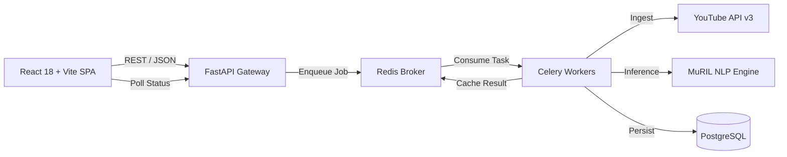

# Kollamo.ai — MCA Project Defense Presentation Slides

**Project Title**: Kollamo.ai — Malayalam-English Sentiment & Audience Intelligence Platform  
**Degree**: Master of Computer Applications (MCA)  
**Presented by**: [INSERT STUDENT NAME] (Reg. No: [INSERT REGISTER NUMBER])  
**Guided by**: [INSERT GUIDE NAME], Department of Computer Applications  

---

## Slide 1: Title & Introduction
- **Project Title**: **Kollamo.ai**
- **Subtitle**: Malayalam-English Sentiment & Audience Intelligence Platform
- **Domain**: Natural Language Processing (NLP) / Distributed Web Systems
- **Student**: [INSERT STUDENT NAME]
- **Department**: Department of Computer Applications
- **Institution**: [INSERT INSTITUTION NAME]

---

## Slide 2: Problem Statement
- **The Regional NLP Divide**:
  - Traditional sentiment analysis engines (VADER, TextBlob, generic English RoBERTa) fail on regional Indian social web conversations.
- **Key Challenges in Malayalam Social Conversations**:
  - **Native Script (`മലയാളം`)**: Agglutinative morphology and vocabulary fragmentation.
  - **Manglish (Romanized Malayalam)**: Massive out-of-vocabulary (OOV) collapse for English tokenizers (e.g., *"Padam adipoli aayirunnu"*).
  - **Intra-Sentential Code-Mixing**: Alternating English and Malayalam syntax in single comments.
  - **Ambiguity & Forced Polarity**: Standard 3-class models cannot handle co-occurring praise and criticism.

---

## Slide 3: Project Objectives
1. **Official Ingestion**: Extract public comment threads using official YouTube Data API v3 (no web scraping).
2. **Five-Class Taxonomy**: Categorize sentiment into `Positive`, `Negative`, `Neutral`, `Mixed`, and `Unsupported`.
3. **Regional Multilingual NLP**: Leverage Google MuRIL fine-tuned for regional Indian language representations.
4. **Decoupled Asynchronous Processing**: Handle bulk jobs via Celery + Redis to prevent web timeouts.
5. **Audience Intelligence Analytics**: Provide interactive dashboards, Net Approval Indices, and filters.
6. **English Readability & Reporting**: Provide on-demand translation with LRU caching and publication-quality PDF export.
7. **Zero Fake AI Policy**: Return transparent model probabilities; explicit HTTP 503 errors if models are offline.

---

## Slide 4: System Architecture

- **Four-Tier Architecture**: Presentation, API Gateway, Distributed Worker, and Persistence Layers.

---

## Slide 5: The 5-Class Sentiment Taxonomy
- Why not just Positive / Negative / Neutral?
  - Social media commentary is multifaceted.
- **The Five Discrete Classes**:
  1. `Positive` (Class 0): Praise, admiration, satisfaction.
  2. `Negative` (Class 1): Criticism, disappointment, anger.
  3. `Neutral` (Class 2): Factual inquiries, neutral statements.
  4. `Mixed` (Class 3): Co-occurring praise and criticism (*"Acting was superb but second half lag aanu"*).
  5. `Unsupported` (Class 4): Non-textual noise, bot spam, emojis, or foreign scripts.
- **Calibrated Probabilities**: Softmax output represents model uncertainty over the categorical distribution, summing strictly to 1.0.

---

## Slide 6: Machine Learning Foundation (Google MuRIL)
- **Model**: `google/muril-base-cased`
- **Why MuRIL over mBERT or XLM-R?**
  - Pretrained specifically on 17 Indian languages and English.
  - Trained on both monolingual text and parallel translated/transliterated pairs.
  - Native representation for Romanized Indian scripts (Manglish).
- **Inference Pipeline**:
  - WordPiece tokenizer (max length 128) $\rightarrow$ MuRIL Transformer $\rightarrow$ 5-Class Classification Head $\rightarrow$ Softmax Probabilities.

---

## Slide 7: Ingestion & Asynchronous Scalability
- **YouTube Ingestion**:
  - Official Google YouTube Data API v3 (`commentThreads.list`).
  - Robust regex supporting standard watch URLs, shortlinks (`youtu.be`), and Shorts.
  - Configurable limits: 50, 100, 250, 500, ALL (with 5,000 safety guardrail).
- **Celery + Redis Architecture**:
  - Jobs transition through: `QUEUED` $\rightarrow$ `FETCHING_COMMENTS` $\rightarrow$ `SENTIMENT_ANALYSIS` $\rightarrow$ `FINALIZING` $\rightarrow$ `COMPLETED`.
  - Non-blocking: FastAPI responds in <50ms with HTTP 202 Accepted.
  - Bounded exponential backoff retries for transient network faults.

---

## Slide 8: Audience Intelligence Dashboard
- **Executive Analytics**:
  - **Video Overview**: Title, thumbnail, channel, views, likes, and total comment counts.
  - **Net Sentiment Approval Index**: Normalized KPI ($+60\%$) summarizing audience perception.
  - **Sentiment Distribution**: Recharts interactive Donut and Bar charts.
  - **Faceted Exploration**: Filter by sentiment pills, search keywords, and pagination.
  - **Inspection Modal**: View complete 5-class probability vectors for any comment.

---

## Slide 9: Translation & PDF Reporting
- **On-Demand Translation**:
  - Preserves original Malayalam/Manglish comments as immutable ground truth.
  - In-memory LRU cache delivers >30x speedup (<1ms) on repeated phrases.
- **Client-Side PDF Generation**:
  - Powered by `jsPDF` directly inside the browser.
  - High-DPI HTML5 canvas font rendering for complex Malayalam Unicode ligatures (Noto Sans Malayalam).
  - Sanitized filenames: `kollamo-ai-analysis-<video-id>.pdf`.

---

## Slide 10: Quality Assurance & Testing Pyramid
- **295 Automated Tests Passing (100% Pass Rate)**:
  - **Backend Pytest**: 177 passed (Unit, security, API integration, regression).
  - **ML Pytest**: 49 passed (Tokenizer, forward pass shapes, taxonomy, contracts).
  - **Frontend Vitest**: 69 passed (Components, dashboards, PDF export, journeys).
  - **Type Checking**: Strict TypeScript (`tsc --noEmit`) with 0 errors.
  - **Production Build**: Vite production compilation in 33.5s.

---

## Slide 11: Security & Defensive Controls
- **Zero Committed Secrets**: `.env.example` templates; no credentials in source control.
- **XSS Sanitization**: React JSX escaping + `DOMPurify` protection for comment text.
- **Strict CORS Policy**: Allowlist of trusted origins; wildcards with credentials disallowed.
- **Token Bucket Rate Limiting**: Protects compute-heavy analysis endpoints.
- **Input Validation**: Pydantic v2 schemas and regex filters rejecting invalid URLs.

---

## Slide 12: Performance Benchmarks
- **Empirical Scalability**:
  - 50 comments: ~1.4 seconds.
  - 500 comments: ~6.8 seconds.
  - 1,000 comments: ~14.2 seconds (Client memory ~48 MB).
  - 3,500 comments: ~44.6 seconds (Processed asynchronously without UI freeze).
- **Client Bundle**: Gzipped JS bundle is ~337 KB.

---

## Slide 13: Live Demonstration Workflow
1. **Single-Comment Sandbox**: Real-time evaluation of pure Malayalam and Manglish.
2. **YouTube Video Analysis**: Submitting a real YouTube video URL.
3. **Asynchronous Telemetry**: Observing live progress indicators.
4. **Dashboard Exploration**: Reviewing KPIs, Recharts graphs, and comment filters.
5. **On-Demand Translation**: Translating regional comments to English.
6. **PDF Report Export**: Downloading the publication-quality analysis report.

---

## Slide 14: Honest Disclosures & Current Limitations
- **Environment**: Tested locally and within Docker multi-container environments; not deployed to public multi-region cloud infrastructure.
- **Authentication**: Single-tenant academic architecture without user logins (JWT/OAuth2).
- **YouTube Quota**: Ingestion constrained by standard 10,000 units/day Google quota.
- **Probabilistic Nature**: Model outputs reflect statistical likelihood, not emotional judgment.

---

## Slide 15: Conclusion & Future Scope
- **Conclusion**:
  - Successfully demonstrated an end-to-end, asynchronous, regional sentiment analysis platform for Malayalam-English social discourse.
  - Bridged linguistic challenges using Google MuRIL and a fine-grained 5-class taxonomy.
- **Future Scope**:
  - Support for additional Dravidian languages (Tamil, Telugu, Kannada).
  - Aspect-based sentiment analysis (acting, music, direction).
  - Horizontal Kubernetes scaling for large-scale enterprise deployments.

---

## Slide 16: Thank You & Q&A
- **Questions & Discussion**
- Open for Technical Defense & Viva Voce.
