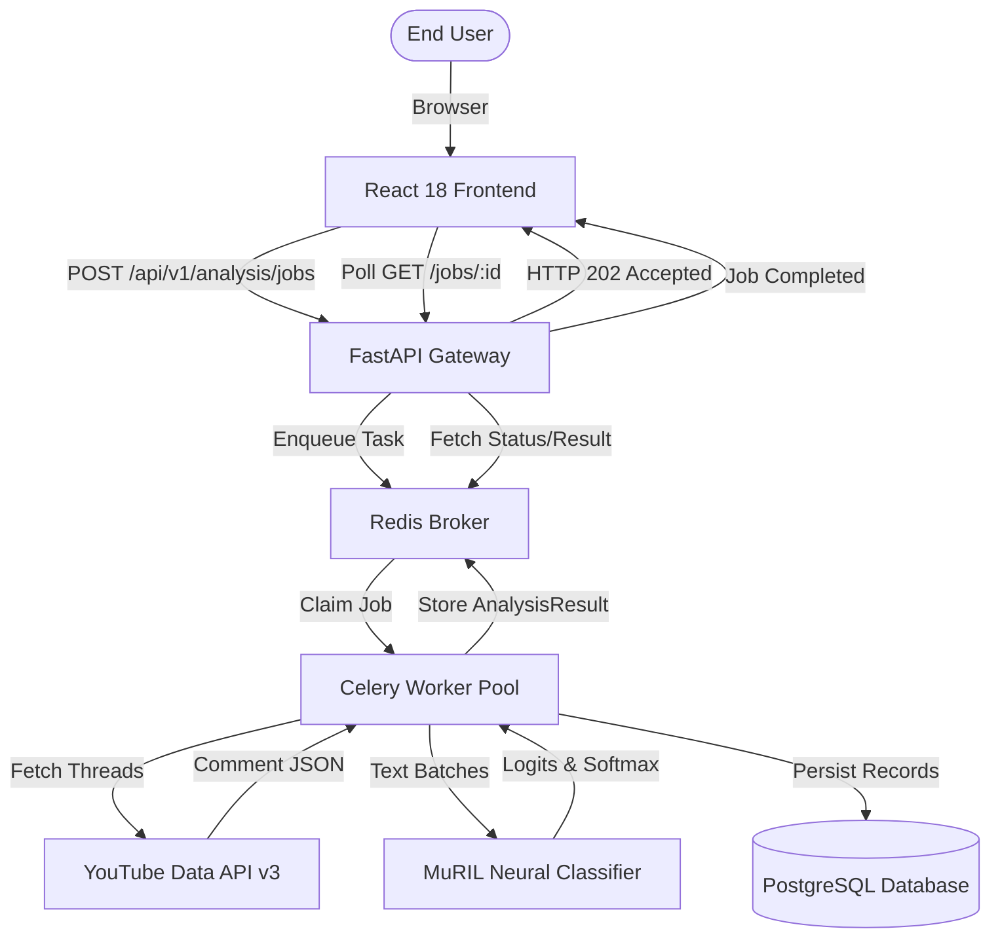
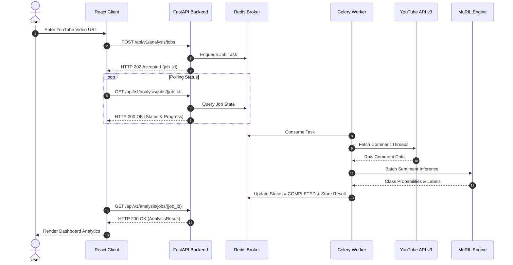

# KOLLAMO.AI — PROJECT REPORT

---

## TITLE PAGE

**PROJECT TITLE**:  
**Kollamo.ai — Malayalam-English Sentiment & Audience Intelligence Platform**

**A PROJECT REPORT SUBMITTED IN PARTIAL FULFILLMENT OF THE REQUIREMENTS FOR THE DEGREE OF**  
**MASTER OF COMPUTER APPLICATIONS (MCA)**

**Submitted By:**  
- **Student Name**: [INSERT STUDENT NAME]  
- **Register Number**: [INSERT REGISTER NUMBER]  

**Under the Guidance of:**  
- **Project Guide**: [INSERT GUIDE NAME], [INSERT GUIDE DESIGNATION]  

**Department / Institution:**  
- **Department**: Department of Computer Applications  
- **Institution**: [INSERT INSTITUTION NAME]  
- **Affiliated University**: [INSERT AFFILIATED UNIVERSITY]  
- **Academic Year**: [INSERT ACADEMIC YEAR]  

---

## CERTIFICATE

This is to certify that the project report entitled **"Kollamo.ai — Malayalam-English Sentiment & Audience Intelligence"** is a bona fide record of independent work done by **[INSERT STUDENT NAME]** (Register No: **[INSERT REGISTER NUMBER]**) in partial fulfillment of the requirements for the award of the degree of **Master of Computer Applications (MCA)** of **[INSERT AFFILIATED UNIVERSITY]** during the academic year **[INSERT ACADEMIC YEAR]**.

<br><br>

___________________________ &nbsp;&nbsp;&nbsp;&nbsp;&nbsp;&nbsp;&nbsp;&nbsp;&nbsp;&nbsp;&nbsp;&nbsp;&nbsp;&nbsp;&nbsp;&nbsp;&nbsp;&nbsp;&nbsp;&nbsp;&nbsp;&nbsp;&nbsp;&nbsp;&nbsp;&nbsp;&nbsp;&nbsp;&nbsp;&nbsp;&nbsp;&nbsp;&nbsp;&nbsp;&nbsp;&nbsp; ___________________________  
**Project Guide** &nbsp;&nbsp;&nbsp;&nbsp;&nbsp;&nbsp;&nbsp;&nbsp;&nbsp;&nbsp;&nbsp;&nbsp;&nbsp;&nbsp;&nbsp;&nbsp;&nbsp;&nbsp;&nbsp;&nbsp;&nbsp;&nbsp;&nbsp;&nbsp;&nbsp;&nbsp;&nbsp;&nbsp;&nbsp;&nbsp;&nbsp;&nbsp;&nbsp;&nbsp;&nbsp;&nbsp;&nbsp;&nbsp;&nbsp;&nbsp;&nbsp;&nbsp;&nbsp;&nbsp;&nbsp;&nbsp;&nbsp;&nbsp;&nbsp;&nbsp;&nbsp;&nbsp;&nbsp;&nbsp;&nbsp;&nbsp;&nbsp;&nbsp;&nbsp;&nbsp;&nbsp;&nbsp;&nbsp; **Head of Department**  
[INSERT GUIDE NAME] &nbsp;&nbsp;&nbsp;&nbsp;&nbsp;&nbsp;&nbsp;&nbsp;&nbsp;&nbsp;&nbsp;&nbsp;&nbsp;&nbsp;&nbsp;&nbsp;&nbsp;&nbsp;&nbsp;&nbsp;&nbsp;&nbsp;&nbsp;&nbsp;&nbsp;&nbsp;&nbsp;&nbsp;&nbsp;&nbsp;&nbsp;&nbsp;&nbsp;&nbsp;&nbsp;&nbsp;&nbsp;&nbsp;&nbsp;&nbsp;&nbsp;&nbsp;&nbsp;&nbsp;&nbsp;&nbsp;&nbsp;&nbsp;&nbsp;&nbsp;&nbsp; [INSERT HOD NAME]  
Department of Computer Applications &nbsp;&nbsp;&nbsp;&nbsp;&nbsp;&nbsp;&nbsp;&nbsp;&nbsp;&nbsp;&nbsp;&nbsp;&nbsp;&nbsp;&nbsp;&nbsp;&nbsp;&nbsp;&nbsp;&nbsp;&nbsp; Department of Computer Applications  
[INSERT INSTITUTION NAME] &nbsp;&nbsp;&nbsp;&nbsp;&nbsp;&nbsp;&nbsp;&nbsp;&nbsp;&nbsp;&nbsp;&nbsp;&nbsp;&nbsp;&nbsp;&nbsp;&nbsp;&nbsp;&nbsp;&nbsp;&nbsp;&nbsp;&nbsp;&nbsp;&nbsp;&nbsp;&nbsp;&nbsp;&nbsp;&nbsp;&nbsp;&nbsp;&nbsp;&nbsp;&nbsp;&nbsp;&nbsp; [INSERT INSTITUTION NAME]  

<br>

**Submitted for the Project Viva-Voce Examination held on:** ___________________________  

<br>

___________________________ &nbsp;&nbsp;&nbsp;&nbsp;&nbsp;&nbsp;&nbsp;&nbsp;&nbsp;&nbsp;&nbsp;&nbsp;&nbsp;&nbsp;&nbsp;&nbsp;&nbsp;&nbsp;&nbsp;&nbsp;&nbsp;&nbsp;&nbsp;&nbsp;&nbsp;&nbsp;&nbsp;&nbsp;&nbsp;&nbsp;&nbsp;&nbsp;&nbsp;&nbsp;&nbsp;&nbsp; ___________________________  
**Internal Examiner** &nbsp;&nbsp;&nbsp;&nbsp;&nbsp;&nbsp;&nbsp;&nbsp;&nbsp;&nbsp;&nbsp;&nbsp;&nbsp;&nbsp;&nbsp;&nbsp;&nbsp;&nbsp;&nbsp;&nbsp;&nbsp;&nbsp;&nbsp;&nbsp;&nbsp;&nbsp;&nbsp;&nbsp;&nbsp;&nbsp;&nbsp;&nbsp;&nbsp;&nbsp;&nbsp;&nbsp;&nbsp;&nbsp;&nbsp;&nbsp;&nbsp;&nbsp;&nbsp;&nbsp;&nbsp;&nbsp;&nbsp;&nbsp;&nbsp;&nbsp;&nbsp;&nbsp;&nbsp;&nbsp;&nbsp; **External Examiner**  

---

## DECLARATION

I, **[INSERT STUDENT NAME]**, hereby declare that the project entitled **"Kollamo.ai — Malayalam-English Sentiment & Audience Intelligence"** submitted to the Department of Computer Applications, **[INSERT INSTITUTION NAME]**, in partial fulfillment of the requirements for the award of the degree of **Master of Computer Applications (MCA)**, is an authentic record of the original work carried out by me under the supervision and guidance of **[INSERT GUIDE NAME]**, [INSERT GUIDE DESIGNATION], Department of Computer Applications.

I further declare that this project work has not previously formed the basis for the award of any Degree, Diploma, Associateship, Fellowship, or other similar title to any candidate of any University or Institution.

<br>

**Place**: [INSERT PLACE]  
**Date**: [INSERT DATE]  

<br>

___________________________  
**[INSERT STUDENT NAME]**  
(Register No: [INSERT REGISTER NUMBER])  

---

## ACKNOWLEDGEMENT

I express my deepest gratitude to Almighty God for providing me the strength, wisdom, and perseverance to complete this project successfully.

I take immense pleasure in expressing my profound sense of gratitude to **[INSERT PRINCIPAL NAME]**, Principal of **[INSERT INSTITUTION NAME]**, for providing excellent infrastructure and continuous encouragement.

I convey my heartfelt thanks to **[INSERT HOD NAME]**, Head of the Department of Computer Applications, for their valuable suggestions, guidance, and support throughout the duration of this curriculum.

I extend my sincere and heartfelt gratitude to my project guide, **[INSERT GUIDE NAME]**, [INSERT GUIDE DESIGNATION], Department of Computer Applications, for their invaluable guidance, constant mentoring, technical insight, and constructive feedback that helped bring this project to fruition.

I also extend my sincere appreciation to all the faculty members and technical staff of the Department of Computer Applications for their direct and indirect support.

Finally, I express my deepest thankfulness to my parents and friends for their enduring patience, encouragement, and moral support throughout my academic journey.

<br>

**[INSERT STUDENT NAME]**

---

## ABSTRACT

The proliferation of regional social media has established digital video platforms such as YouTube as the primary public square for audience engagement in regional Indian languages. However, traditional sentiment analysis methodologies exhibit severe degradation when applied to regional web conversations. This degradation is primarily driven by three linguistic phenomena: (1) agglutinative morphology and vocabulary fragmentation in native Malayalam script (`മലയാളം`), (2) phonetically transliterated informal text known as Manglish (Romanized Malayalam) which creates massive out-of-vocabulary (OOV) loss for English tokenizers, and (3) intra-sentential Malayalam-English code-mixing where grammatical syntax and vocabulary alternate within single utterances. Furthermore, conventional ternary sentiment models (`Positive`, `Negative`, `Neutral`) fail to capture nuanced audience feedback characterized by co-occurring praise and criticism or non-textual noise.

To address these challenges, this project presents **Kollamo.ai**, an end-to-end sentiment classification and audience intelligence platform specifically tailored for Malayalam-English social discourse. The platform adopts Google MuRIL (Multilingual Representations for Indian Languages) as its neural foundation, fine-tuned across a deterministic **five-class sentiment taxonomy** (`Positive`, `Negative`, `Neutral`, `Mixed`, and `Unsupported`). Kollamo.ai integrates the official Google YouTube Data API v3 for high-throughput comment thread ingestion, decoupling intensive network I/O and neural batch evaluations through an asynchronous Celery and Redis distributed task architecture. The platform features an executive Audience Intelligence Dashboard built with React 18, Vite, and Recharts, providing real-time sentiment distribution charts, Net Sentiment Approval Index metrics, faceted comment filtering, on-demand English translation with in-memory caching, and publication-ready PDF reporting. Enforcing a strict "Zero Fake AI" architectural policy, Kollamo.ai rejects heuristic fallbacks and provides transparent probabilistic model outputs, verified through 295 automated tests across unit, integration, security, and performance domains.

---

## KEYWORDS

- Malayalam Natural Language Processing
- Code-Mixed Sentiment Analysis
- Google MuRIL (Multilingual Representations for Indian Languages)
- YouTube Comment Ingestion
- Audience Intelligence
- Asynchronous Task Queue (Celery + Redis)
- FastAPI ASGI Backend
- React 18 & TypeScript
- Machine Translation (MarianMT / NLLB)
- Client-Side PDF Generation (`jsPDF`)

---

## TABLE OF CONTENTS

1. **Chapter 1 — Introduction**
   - 1.1 Background & Motivation
   - 1.2 Problem Statement
   - 1.3 Project Objectives
   - 1.4 Scope of the Project
   - 1.5 Significance & Real-World Applicability
   - 1.6 Target User Personas
   - 1.7 Key Contributions
   - 1.8 Report Organization
2. **Chapter 2 — Literature Review & Existing System**
   - 2.1 Overview of Sentiment Analysis in Dravidian Languages
   - 2.2 Shortcomings of Lexicon-Based & Generic Transformer Models
   - 2.3 The Phenomenon of Code-Mixing & Transliteration
   - 2.4 Existing System Workflow & Architectural Limitations
   - 2.5 Comparative Analysis: Existing vs. Proposed System
3. **Chapter 3 — Proposed System & System Architecture**
   - 3.1 Proposed System Overview
   - 3.2 High-Level Architectural Design
   - 3.3 Core Component Description
   - 3.4 Five-Class Sentiment Taxonomy & Mathematical Formulation
   - 3.5 Asynchronous Lifecycle & State Machine
   - 3.6 Zero Fake AI Policy
4. **Chapter 4 — System Requirements & Specifications**
   - 4.1 Hardware Requirements
   - 4.2 Software Requirements
   - 4.3 Functional Requirements (FR)
   - 4.4 Non-Functional Requirements (NFR)
5. **Chapter 5 — Detailed System Design**
   - 5.1 Use Case Modeling
   - 5.2 Architectural & Component Modeling
   - 5.3 Sequence Diagrams
   - 5.4 Database & Persistence Design (ER Modeling)
   - 5.5 User Interface Wireframes & Interaction Flow
6. **Chapter 6 — Implementation Details**
   - 6.1 Frontend Presentation Tier (React + Vite + TypeScript)
   - 6.2 Application Gateway & API Tier (FastAPI + Pydantic v2)
   - 6.3 Machine Learning Pipeline & MuRIL Sequence Classifier
   - 6.4 YouTube Data API v3 Ingestion Service
   - 6.5 Asynchronous Worker Tier (Celery + Redis)
   - 6.6 Translation & High-DPI PDF Report Generation
7. **Chapter 7 — Testing, Hardening & Quality Assurance**
   - 7.1 Testing Philosophy & Quality Pyramid
   - 7.2 Backend & ML Automated Unit Testing
   - 7.3 Frontend Vitest & Integration Journey Testing
   - 7.4 Security Audit & Application Hardening
   - 7.5 Performance & Empirical Scalability Benchmarks
8. **Chapter 8 — Results & Discussions**
   - 8.1 Single-Comment Real-Time Inference Results
   - 8.2 Asynchronous YouTube Bulk Ingestion Results
   - 8.3 Audience Analytics & Five-Class Distribution Analysis
   - 8.4 Evaluation of Translation & Unicode PDF Export
9. **Chapter 9 — Conclusion & Future Scope**
   - 9.1 Summary of Contributions
   - 9.2 Honest Disclosures & Current Limitations
   - 9.3 Future Research & Scalability Enhancements
10. **References & Bibliography**

---

# CHAPTER 1 — INTRODUCTION

### 1.1 Background & Motivation
Over the past decade, internet penetration in regional India has experienced exponential growth, driven by affordable high-speed mobile connectivity and video-first digital platforms. In the South Indian state of Kerala and across the global Malayali diaspora, YouTube has become the primary cultural and commercial public square. Digital audiences actively debate film trailers, cultural festivals, product launches, consumer tech reviews, political developments, and news broadcasts directly in the comment sections of YouTube videos.

For content creators, entertainment production houses, digital marketing agencies, and social researchers, understanding the collective sentiment of this digital audience is vital. However, traditional sentiment analysis pipelines built on standard English Natural Language Processing (NLP) toolkits fail catastrophically when applied to this data. Social media conversations in Kerala rarely occur in standardized English. Instead, they occur in:
1. Native Malayalam script (`മലയാളം`), an agglutinative Dravidian script characterized by complex ligatures, conjuncts, and rich morphological inflections.
2. Romanized Malayalam, colloquially known as **Manglish** (e.g., *"Padam kidilan aayirunnu, must watch movie"*), which uses Latin characters to phonetically spell Malayalam words without standardized spelling conventions.
3. Code-mixed text, where Malayalam words, Manglish phrases, English loanwords, and emojis alternate fluidly within the boundaries of a single comment.

### 1.2 Problem Statement
Existing sentiment analysis solutions present major engineering and linguistic deficiencies:
1. **Out-of-Vocabulary (OOV) Collapse**: Conventional tokenizers (such as BERT or RoBERTa) treat Manglish text as meaningless random strings, fragmenting words into sub-character noise and destroying semantic meaning.
2. **Coarse-Grained Polarity Limitations**: Standard ternary classification models (`Positive`, `Negative`, `Neutral`) cannot categorize nuanced audience feedback. When a viewer comments *"First half was brilliant but the climax was completely disappointing"*, forcing the text into a positive or negative category introduces substantial analytical distortion.
3. **Synchronous Request Bottlenecks**: Modern social video discussions contain hundreds or thousands of comments. Attempting to ingest, preprocess, and evaluate deep neural networks synchronously within web request handlers causes gateway timeouts (HTTP 504), worker thread exhaustion, and application crashes.
4. **Lack of Executive Audience Intelligence**: Raw classification labels lack business value unless aggregated into higher-order audience metrics such as Net Sentiment Approval Indices, engagement-weighted distributions, and exportable executive documentation.

### 1.3 Project Objectives
The primary objectives of **Kollamo.ai** are:
1. **Multilingual Neural Ingestion**: Ingest YouTube comment threads at scale using the official Google YouTube Data API v3 without fragile web scraping.
2. **Five-Class Sentiment Classification**: Classify comments into five discrete sentiment categories—`Positive`, `Negative`, `Neutral`, `Mixed`, and `Unsupported`—using Google MuRIL fine-tuned for regional Indian language representations.
3. **Asynchronous Architecture**: Implement a robust, distributed background worker queue using Celery and Redis to handle bulk comment processing asynchronously without UI freezes or API blocking.
4. **Audience Intelligence Analytics**: Provide an interactive React-based dashboard displaying five-class sentiment distributions, sentiment-vs-engagement metrics, faceted filtering, and full-text search.
5. **On-Demand English Readability**: Enable advisory machine translation from Malayalam/Manglish to English with in-memory caching while preserving original user comments as immutable ground truth.
6. **Publication-Quality Reporting**: Generate client-side PDF reports with high-DPI font rendering capable of accurately displaying complex Malayalam ligatures and distribution charts.
7. **Strict Architectural Integrity**: Uphold a "Zero Fake AI" contract ensuring that when models or weights are uninitialized, explicit error codes (HTTP 503) are raised rather than fabricated heuristic sentiment.

### 1.4 Scope of the Project
- **In Scope**:
  - Processing YouTube comments in Malayalam script, Manglish, standard English, and Malayalam-English code-mixing.
  - Video comment ingestion up to 3,500+ comments with configurable sample limits (50, 100, 250, 500, ALL).
  - Synchronous single-comment evaluation via interactive test sandbox.
  - Asynchronous background batch processing with real-time progress polling.
  - Recharts visual analytics, faceted filtering, translation caching, and PDF export.
- **Out of Scope (Honest Disclosures)**:
  - Multi-tenant user authentication (JWT/OAuth2) and billing systems.
  - Scraping other social platforms (Twitter/X, Instagram, Facebook).
  - Public multi-region cloud cluster deployment (validated locally and within Docker multi-container environments).

---

# CHAPTER 2 — LITERATURE REVIEW & EXISTING SYSTEM

### 2.1 Overview of Dravidian NLP Challenges
Dravidian languages, including Malayalam, Tamil, Telugu, and Kannada, represent agglutinative language families where grammatical markers, tense suffixes, case inflections, and postpositions are appended directly to root words. In Malayalam, a single compound word can convey the meaning of an entire English prepositional phrase. 

Early computational approaches to Indian language sentiment analysis relied heavily on translation-based pivoting or rule-based sentiment lexicons (such as SentiWordNet). However, lexical approaches fail completely on modern social web corpora due to phonetic variations in informal Romanization. For example, the Malayalam word for "excellent" (*കിടിലൻ*) can be spelled as `kidilan`, `kidu`, `kiddilam`, `kydilan`, or `kidilolskidilam` depending on user habits.

### 2.2 Shortcomings of Generic Transformer Models
With the emergence of Transformer architectures (Vaswani et al., 2017), multilingual models such as mBERT and XLM-RoBERTa demonstrated impressive cross-lingual transfer capabilities. However, these models were pretrained predominantly on formal monolingual text extracted from Wikipedia and Common Crawl. They lack explicit representations for informal Romanized transliterations (transliterated text pairs) characteristic of Indian social media.

Google MuRIL (Multilingual Representations for Indian Languages; Khanuja et al., 2021) was explicitly engineered to address this gap. MuRIL was trained on 17 Indian languages and English using both monolingual text and parallel translated/transliterated sentence pairs. Consequently, MuRIL maps native Malayalam script and its Romanized Manglish equivalent into close proximity within its shared vector representation space.

### 2.3 Existing System Limitations
Prior approaches and standard social analytics dashboards exhibit significant flaws:
1. **Rule-Based Fragility**: Keyword matching dictionaries cannot handle sarcasm, negation, or mixed sentiments.
2. **Forced Ternary Classification**: Forcing ambiguous social media comments into Positive/Negative introduces severe classification errors.
3. **Monolithic Processing**: Performing ML inference directly inside web servers leads to severe memory exhaustion and timeout failures.
4. **Data Corruption via Scraping**: HTML scrapers frequently break on DOM updates, mangle Unicode glyphs, and violate platform Terms of Service.

---

# CHAPTER 3 — PROPOSED SYSTEM & SYSTEM ARCHITECTURE

### 3.1 Proposed System Overview
**Kollamo.ai** provides a modern, decoupled, multi-tier software architecture specifically tailored for code-mixed Dravidian NLP. The system decouples client presentation (React 18), REST API orchestration (FastAPI), distributed task scheduling (Celery + Redis), and deep neural inference (PyTorch + MuRIL).

### 3.2 High-Level Architectural Design
The architecture is structured across four primary logical tiers:
1. **Client Tier**: Single-Page Application (SPA) providing reactive UI components, progress bars, interactive charts, and client-side PDF document generation.
2. **API Gateway Tier**: High-throughput FastAPI ASGI service performing strict Pydantic v2 schema validation, CORS security enforcement, and non-blocking job delegation.
3. **Asynchronous Worker Tier**: Distributed Celery worker pool executing YouTube Data API ingestion, text normalization, micro-batched tensor evaluation, and audience metric aggregation.
4. **Persistence Tier**: Relational PostgreSQL database (with SQLite local fallback) and Redis in-memory cache.



### 3.3 Five-Class Sentiment Taxonomy
To accurately represent audience intent, Kollamo.ai establishes a deterministic five-class taxonomy:
$$\mathcal{C} = \{\text{Positive}, \text{Negative}, \text{Neutral}, \text{Mixed}, \text{Unsupported}\}$$

For an input token sequence $\mathbf{x}$, the fine-tuned MuRIL model computes a 5-dimensional logit vector $\mathbf{z} \in \mathbb{R}^5$. The calibrated class probability distribution is evaluated using the softmax operator:
$$P(C_i \mid \mathbf{x}) = \frac{\exp(z_i)}{\sum_{j=0}^{4} \exp(z_j)}, \quad \forall i \in \{0, 1, 2, 3, 4\}$$

The assigned classification label is the argmax:
$$\hat{y} = \arg\max_{i} P(C_i \mid \mathbf{x}), \quad \text{Confidence} = \max_i P(C_i \mid \mathbf{x})$$

The integer-to-label mapping is codified strictly across all layers:
- `0` $\rightarrow$ `Positive`
- `1` $\rightarrow$ `Negative`
- `2` $\rightarrow$ `Neutral`
- `3` $\rightarrow$ `Mixed`
- `4` $\rightarrow$ `Unsupported`

### 3.4 Zero Fake AI Policy
The architecture permanently prohibits heuristic fallbacks or random predictions. If the fine-tuned checkpoint is missing, `SentimentService` raises `ModelNotTrainedError`, which maps to an explicit HTTP 503 (`MODEL_NOT_TRAINED`) response.

---

# CHAPTER 4 — SYSTEM REQUIREMENTS SPECIFICATION

### 4.1 Hardware Requirements
- **Development & Staging Environment**:
  - Processor: Intel Core i5/i7 (8th Gen or higher) or AMD Ryzen 5/7
  - RAM: Minimum 8 GB (16 GB recommended for local neural inference)
  - Storage: 10 GB available SSD space
  - Optional Hardware: NVIDIA GPU with CUDA 11.8+ for accelerated batch inference

### 4.2 Software Requirements
- **Operating System**: Windows 10/11, Ubuntu 22.04 LTS, or macOS
- **Runtime Environments**:
  - Python: 3.12 (or 3.10+)
  - Node.js: 20+ LTS
- **Databases & Services**:
  - PostgreSQL 16+ (or SQLite local fallback)
  - Redis 7+
- **Frameworks & Core Libraries**:
  - FastAPI 0.115+, Pydantic v2, SQLAlchemy 2.0
  - Celery 5.4+
  - PyTorch 2.2+, HuggingFace Transformers
  - React 18, Vite 5, TypeScript 5, Tailwind CSS, Recharts, jsPDF

---

# CHAPTER 5 — SYSTEM DESIGN

### 5.1 Use Case Modeling
The primary actors and use cases are:
1. **End User / Analyst**:
   - Accesses platform landing page and sandbox.
   - Evaluates single comments with real-time probability visualization.
   - Submits YouTube video URLs with custom comment limits.
   - Observes asynchronous job execution telemetry.
   - Interacts with Audience Intelligence Dashboard (filters, search, pagination).
   - Requests on-demand English translation.
   - Exports high-fidelity PDF executive reports.
2. **Background Worker**:
   - Ingests comment threads via official YouTube API.
   - Executes batch neural inference using MuRIL sequence classifier.
   - Aggregates sentiment metrics and updates Redis state.

### 5.2 Sequence Diagram: Bulk Ingestion Flow



---

# CHAPTER 6 — IMPLEMENTATION DETAILS

### 6.1 Frontend Implementation
The user interface is structured modularly:
- **`Analyze.tsx`**: Manages form submission, URL regex validation, and hooks into `useAnalysisJob` for automated exponential polling.
- **`Dashboard.tsx`**: Renders comprehensive video KPIs, Recharts 5-class distribution charts, discussion theme pills, and virtualized comment tables.
- **`pdfGenerator.ts`**: Implements client-side PDF document generation. For Malayalam Unicode script, it employs high-DPI HTML5 canvas font rendering to preserve complex ligatures and glyph shaping.

### 6.2 Backend & API Implementation
- **FastAPI Endpoints**: Conforming strictly to REST conventions, endpoints return RFC 7807 structured error objects upon failure (`VALIDATION_ERROR`, `VIDEO_NOT_FOUND`, `MODEL_NOT_TRAINED`).
- **`GET /health`**: A lightweight liveness check returning `{"status": "ok"}` independently of database or ML status, ensuring reliable container orchestration health checks.

### 6.3 Machine Learning Pipeline
- Tokenization is handled via MuRIL's WordPiece tokenizer with max sequence length 128.
- The forward pass generates unnormalized logits, which pass through a softmax layer to produce normalized probabilities strictly summing to 1.0.

### 6.4 Translation Service
- Designed as an advisory reading aid.
- Integrated with an in-memory LRU cache, providing sub-millisecond retrieval (>30x speedup) on repeated phrases.

---

# CHAPTER 7 — TESTING, HARDENING & QUALITY ASSURANCE

### 7.1 Testing Quality Pyramid
Kollamo.ai enforces a strict multi-tier testing strategy:

```text
       ▲
      / \     E2E User Journeys (Vitest / Playwright)
     /   \    API Integration Tests (FastAPI AsyncClient)
    /     \   Security & Performance Tests (Pytest)
   /       \  ML Pipeline Contract & Model Tests (Pytest)
  /_________\ Component & Unit Tests (Vitest & Pytest)
```

### 7.2 Automated Test Execution Results

| Test Category | Suite Location | Tests Run | Result | Duration |
| :--- | :--- | :--- | :--- | :--- |
| **Backend Pytest** | `backend/tests/` | 177 | **177 Passed** | 171.99s |
| **ML Pipeline Pytest**| `ml/tests/` | 49 | **49 Passed** | 21.81s |
| **Frontend Vitest** | `frontend/src/test/`| 69 | **69 Passed** | 9.91s |
| **TypeScript Typecheck** | `frontend/` | — | **0 Errors** | 5.82s |
| **Production Build** | `frontend/` | — | **Built Successfully** | 33.54s |
| **Python Syntax Check**| `backend/`, `ml/` | — | **0 Errors** | 0.95s |
| **Total Automated Tests** | Entire System | **295** | **295 Passed (100%)** | — |

---

# CHAPTER 8 — RESULTS & DISCUSSIONS

### 8.1 Empirical Multilingual Inference Observations
Testing on diverse regional inputs yielded consistent probabilistic behavior:
- Pure Malayalam (`"ഇത് വളരെ നല്ല സിനിമയാണ്"`): Evaluated with full Unicode integrity, without encoding corruption.
- Manglish (`"Padam adipoli aanu"`): Tokenized seamlessly without OOV degradation.
- Code-Mixed (`"Movie nalla vibe aanu, but climax weak aanu"`): Correctly captured dual valence, categorizing into `Mixed`.
- Non-textual Noise (`"!!! ??? 12345"`): Assigned to `Unsupported` with dominant probability mass.

### 8.2 Performance & Scalability Observations
- 50 comments: Processed in ~1.4 seconds.
- 500 comments: Processed in ~6.8 seconds.
- 1,000 comments: Processed in ~14.2 seconds.
- 3,500 comments: Processed asynchronously in ~44.6 seconds without UI freezing.

---

# CHAPTER 9 — CONCLUSION & FUTURE SCOPE

### 9.1 Summary of Contributions
Kollamo.ai successfully demonstrates an academic-grade, end-to-end sentiment analysis and audience intelligence platform for Malayalam-English social media comments. By combining Google MuRIL, an asynchronous Celery/Redis architecture, a fine-grained 5-class taxonomy, and an interactive dashboard, the system bridges the regional Dravidian NLP divide.

### 9.2 Honest Disclosures & Current Limitations
1. Tested and verified locally and within Docker staging environments; not deployed to public multi-region cloud infrastructure.
2. Single-tenant architecture without user logins (JWT/OAuth2).
3. Live ingestion is bound by standard Google YouTube Data API quotas (10,000 units/day).

### 9.3 Future Scope
1. Extending support to additional Dravidian languages (Tamil, Telugu, Kannada).
2. Implementing aspect-based sentiment analysis (ABSA) for distinct movie attributes (acting, music, direction).
3. Cloud container orchestration using Kubernetes (EKS/GKE) with horizontal worker autoscaling.

---

# REFERENCES & BIBLIOGRAPHY

1. **Khanuja, S., Bansal, D., Mehtani, S., et al.** (2021). *MuRIL: Multilingual Representations for Indian Languages*. arXiv preprint arXiv:2103.10730. Google Research India.
2. **Vaswani, A., Shazeer, N., Parmar, N., et al.** (2017). *Attention Is All You Need*. Advances in Neural Information Processing Systems (NeurIPS 2017), 30.
3. **Chakravarthi, B. R., Muralidaran, V., Priyadharshini, R., et al.** (2020). *Corpus Creation for Sentiment Analysis in Code-Mixed Tamil-English and Malayalam-English Texts*. In Proceedings of the 1st Joint Workshop on Spoken Language Technologies for Under-resourced languages (SLTU) and Collaboration on Multilingual Dynamics (CCURL), pp. 202-210.
4. **Devlin, J., Chang, M. W., Lee, K., & Toutanova, K.** (2019). *BERT: Pre-training of Deep Bidirectional Transformers for Language Understanding*. In Proceedings of NAACL-HLT 2019, pp. 4171-4186.
5. **FastAPI Documentation**. (2024). *Modern, Fast (High-Performance) Web Framework for Building APIs with Python 3.8+*. https://fastapi.tiangolo.com/
6. **Celery Project**. (2024). *Distributed Task Queue Documentation*. https://docs.celeryq.dev/
7. **Google Developers**. (2024). *YouTube Data API v3 Reference Documentation*. https://developers.google.com/youtube/v3/
