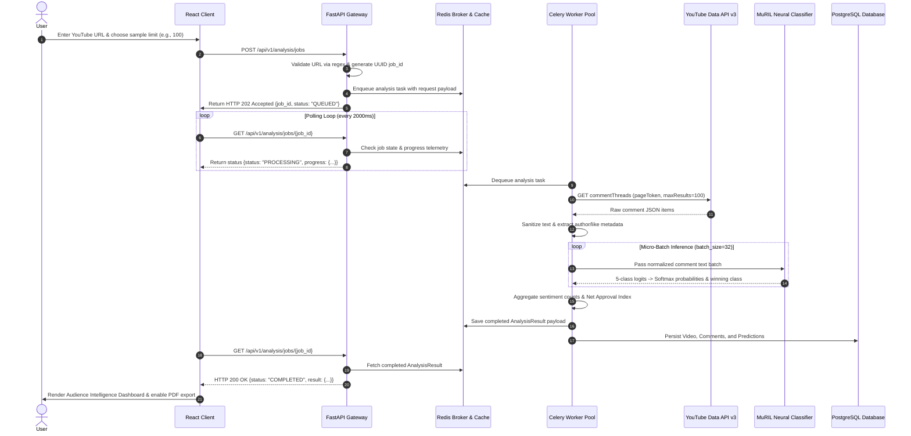
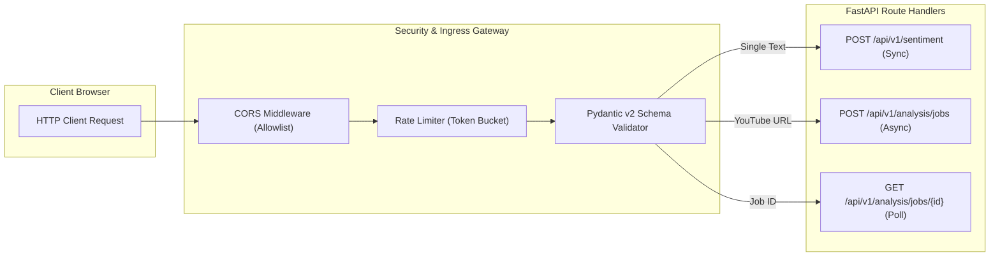
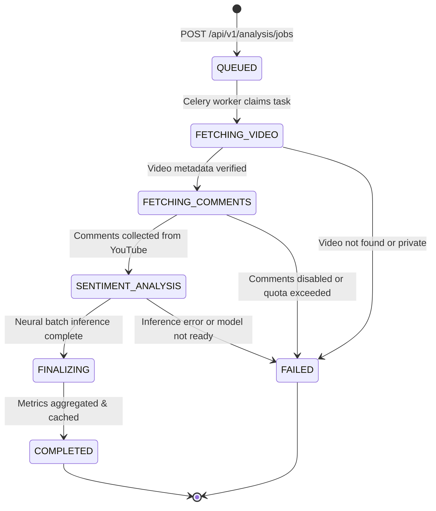
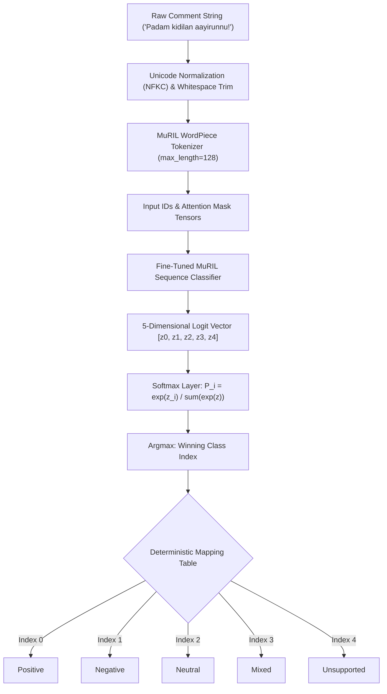
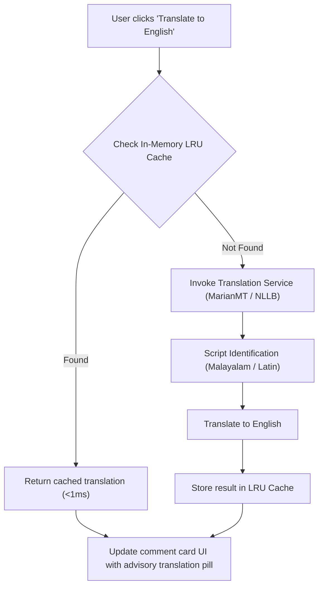
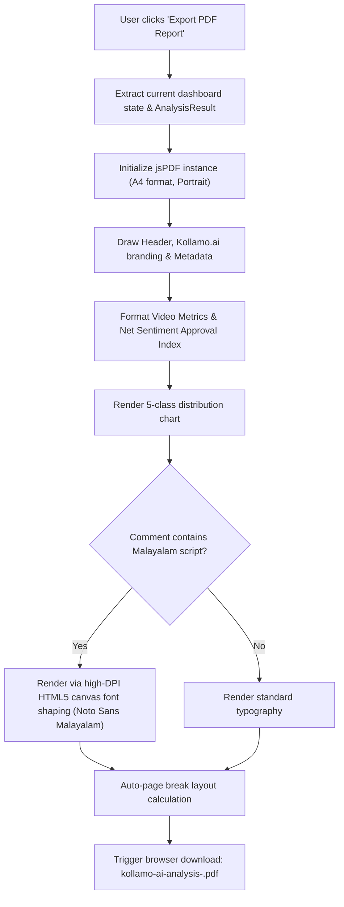

# System Architecture Specification — Kollamo.ai

## 1. High-Level Architecture Overview

**Kollamo.ai** is an academic Master of Computer Applications (MCA) platform designed for end-to-end sentiment classification and audience intelligence across regional Indian social web conversations. Specifically tailored for **Malayalam script (`മലയാളം`)**, **Manglish** (Romanized Malayalam), **English**, and **Malayalam-English code-mixed comments**, Kollamo.ai bridges regional linguistic challenges through deep learning, distributed background workers, and reactive data visualization.

```mermaid
flowchart TB
    subgraph ClientTier ["Client Presentation Layer (React 18 + Vite + TypeScript)"]
        UI_Home["Landing Page & Overview"]
        UI_Sandbox["Single Comment Sandbox"]
        UI_Analyze["YouTube Ingestion Trigger"]
        UI_Dashboard["Audience Dashboard & Analytics"]
        UI_PDF["Client-Side PDF Generator"]
    end

    subgraph GatewayTier ["API & Application Gateway Layer (FastAPI)"]
        HealthEndpoint["GET /health & /api/health"]
        SentimentEndpoint["POST /api/v1/sentiment"]
        JobSubmitEndpoint["POST /api/v1/analysis/jobs"]
        JobStatusEndpoint["GET /api/v1/analysis/jobs/{job_id}"]
        TranslationEndpoint["POST /api/v1/translate"]
        CORS_Middleware["CORS & Origin Validation"]
        RateLimiter["Token Bucket Rate Limiter"]
    end

    subgraph WorkerTier ["Distributed Asynchronous Processing (Celery 5)"]
        Broker["Redis Message Broker (db 0)"]
        WorkerPool["Celery Worker Pool (Prefetch & Concurrency Control)"]
        YT_Client["YouTube Data API v3 Ingestion Client"]
        Cleaner["Unicode Normalizer (NFKC) & Sanitizer"]
        ML_Head["MuRIL Neural Sequence Classification Head"]
        Translation_Engine["MarianMT / In-Memory Translation Engine"]
        Metric_Aggregator["Audience Metric Aggregator"]
    end

    subgraph StorageTier ["Persistence & In-Memory State Layer"]
        PostgresDB[("PostgreSQL 16 / SQLite Engine")]
        RedisStore[("Redis In-Memory State & Result Store")]
        ModelWeights[("Fine-Tuned MuRIL Checkpoints")]
    end

    UI_Home -.-> UI_Sandbox
    UI_Sandbox -->|POST /api/v1/sentiment| SentimentEndpoint
    UI_Analyze -->|POST /api/v1/analysis/jobs| JobSubmitEndpoint
    UI_Dashboard -->|GET /api/v1/analysis/jobs/{job_id}| JobStatusEndpoint
    UI_Dashboard -->|POST /api/v1/translate| TranslationEndpoint
    UI_Dashboard --> UI_PDF

    JobSubmitEndpoint --> CORS_Middleware --> RateLimiter --> Broker
    JobStatusEndpoint --> RedisStore
    Broker --> WorkerPool

    WorkerPool --> YT_Client
    YT_Client --> Cleaner
    Cleaner --> ML_Head
    ML_Head --> ModelWeights
    ML_Head --> Translation_Engine
    Translation_Engine --> Metric_Aggregator
    Metric_Aggregator --> RedisStore
    Metric_Aggregator --> PostgresDB
```

---

## 2. Component Architecture

### 2.1 Presentation Layer (`frontend/`)
The frontend is built using **React 18**, **TypeScript 5**, **Tailwind CSS**, and **Vite 5**:
- **`LandingPage` (`src/pages/Home.tsx`)**: System orientation, architecture summary, and navigation.
- **`Sandbox` (`src/pages/Sandbox.tsx`)**: Instantaneous synchronous evaluation of single comments with client-side script classification (`Malayalam`, `Latin/Manglish`, `Code-Mixed`) and probability distribution bars.
- **`Analyze` (`src/pages/Analyze.tsx`)**: YouTube video ingestion submission form with sample size controls (50, 100, 250, 500, ALL) and sorting parameters (`most_liked`, `newest`, `oldest`), displaying live lifecycle progress telemetry (`AnalysisProgress`).
- **`Dashboard` (`src/pages/Dashboard.tsx`)**: Comprehensive audience intelligence visualization powered by **Recharts**:
  - `VideoOverview`: Video thumbnail, title, channel, views, likes, and total comment counts.
  - `MetricCards`: Total analyzed comments, Net Sentiment Approval Index (+60%), and dominant sentiment pill.
  - `SentimentDistribution`: Interactive Donut and Bar charts toggling across the 5 discrete classes (`Positive`, `Negative`, `Neutral`, `Mixed`, `Unsupported`).
  - `CommentsTable`: Virtualized, searchable, and filtered comment feed with on-demand translation triggers.
  - `CommentDetailsModal`: Deep inspection modal rendering individual calibrated class probabilities summing to 1.0.
- **`PdfGenerator` (`src/utils/pdfGenerator.ts`)**: Publication-quality executive summary export using `jsPDF` and high-DPI HTML5 canvas font rendering for Malayalam ligatures.

### 2.2 Application Programming Interface (`backend/app/api/`)
The API layer is built on **FastAPI** and **Pydantic v2**:
- **Liveness & Readiness**:
  - `GET /health`: Minimal machine-readable probe returning `{"status": "ok"}` with zero downstream dependencies (no DB, Redis, or ML blocking).
  - `GET /api/health`: Deep health probe verifying status of PostgreSQL, Redis broker, and MuRIL predictor.
- **Sentiment Inference**:
  - `POST /api/v1/sentiment`: Synchronous classification for single comments returning top label, confidence score, and normalized probabilities for all 5 classes.
- **Asynchronous Analysis Workflow**:
  - `POST /api/v1/analysis/jobs`: Accepts YouTube URL, generates UUID `job_id`, enqueues task in Celery, and immediately returns HTTP `202 Accepted` with status `QUEUED`.
  - `GET /api/v1/analysis/jobs/{job_id}`: Polls execution state (`QUEUED` → `PROCESSING` → `COMPLETED` / `FAILED`) and delivers final `AnalysisResult`.
- **Translation Services**:
  - `POST /api/v1/translate`: Translates submitted Malayalam/Manglish text to English with in-memory caching while preserving original comment text verbatim.

### 2.3 Machine Learning Pipeline (`ml/` & `backend/ml/`)
- **Foundation Model**: `google/muril-base-cased` (Multilingual Representations for Indian Languages), pretrained on 17 Indian languages and English using both monolingual text and transliterated pairs.
- **Classification Head**: PyTorch sequence classification head mapped to a deterministic **5-class sentiment taxonomy**:
  - `0` → `Positive`
  - `1` → `Negative`
  - `2` → `Neutral`
  - `3` → `Mixed`
  - `4` → `Unsupported`
- **Zero Fake AI Policy**: If model weights are uninitialized or missing, `SentimentService` raises `ModelNotTrainedError` or `ModelLoadingError`, which FastAPI maps to HTTP 503 (`MODEL_NOT_TRAINED`). The platform never falls back to fake heuristic predictions.

### 2.4 Asynchronous Worker Engine (`backend/app/workers/`)
- **Celery & Redis**: Background job processing queue decoupling long-running network I/O and neural batch evaluations from FastAPI request threads.
- **Worker Pipeline**:
  1. `FETCHING_VIDEO`: Queries YouTube Data API v3 for video metadata.
  2. `FETCHING_COMMENTS`: Paginates through YouTube comment threads up to requested limit.
  3. `SENTIMENT_ANALYSIS`: Feeds extracted comments into micro-batched MuRIL tensor evaluations.
  4. `FINALIZING`: Calculates sentiment counts, percentages, and engagement metrics.
  5. `COMPLETED`: Stores result in transient Redis store and persists records into PostgreSQL.

---

## 3. Detailed Data Flow



---

## 4. Request Flow Architecture



---

## 5. Asynchronous Processing Lifecycle

The analysis job transitions through a strict, deterministic state machine:



---

## 6. Sentiment Inference & Taxonomy Mapping



---

## 7. On-Demand Translation Flow



---

## 8. Client-Side PDF Generation Flow


