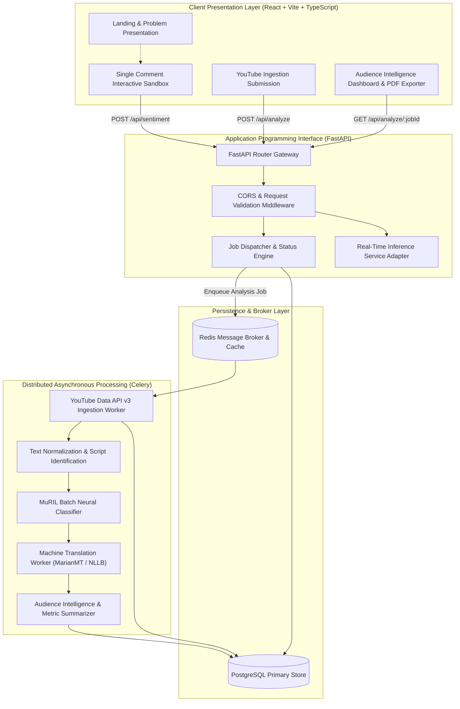
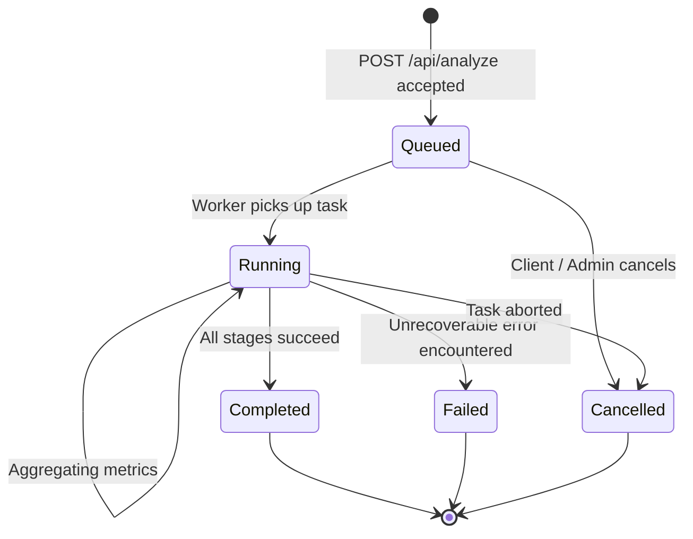

# System Architecture — Kollamo.ai

## 1. Executive Summary

**Kollamo.ai** is an academic Master of Computer Applications (MCA) platform engineered for sentiment analysis and audience intelligence on regional Indian social web conversations. The platform focuses on Malayalam script, Manglish (Romanized Malayalam), English, and Malayalam-English code-mixed comments extracted from YouTube videos.

The system addresses the challenge of code-mixing, regional slang, phonetic transliterations, and Dravidian script morphology through Google MuRIL (Multilingual Representations for Indian Languages).

---

## 2. High-Level Architecture Diagram

---

## 3. Component Deep Dive

### 3.1 Frontend (React, Vite, TypeScript, Tailwind CSS)
- **Role**: Provides a clean, accessible, and responsive user experience.
- **Key Modules**:
  - `Sandbox`: Immediate single-comment sentiment testing with script identification and confidence distributions.
  - `Analyze`: Ingestion configuration (50, 100, 250, 500, ALL comments; Most Liked, Newest, Oldest sort).
  - `Dashboard`: Rich visual analytics (sentiment distribution, sentiment vs. engagement, top comments, exportable PDF).
- **Design Tokens**: Standardized palette with semantic sentiment tokens (Positive, Negative, Neutral, Mixed, Unsupported). Never relies on color alone.

### 3.2 Backend API (FastAPI, Pydantic, SQLAlchemy)
- **Role**: Exposes REST endpoints, validates inputs, coordinates inference, and tracks job progression.
- **Endpoints**:
  - `GET /api/health`: Health status of database, Redis, and ML models.
  - `POST /api/sentiment`: Real-time single comment inference.
  - `POST /api/analyze`: Asynchronous bulk ingestion trigger; returns `job_id`.
  - `GET /api/analyze/{job_id}`: Job execution telemetry and audience summary.

### 3.3 Asynchronous Worker Engine (Celery, Redis)
- **Role**: Prevents FastAPI request timeouts and guarantees throughput across large comment volumes (up to 3,500+ comments).
- **Pipelines**:
  1. *Ingestion*: Fetches YouTube comment threads using official YouTube Data API v3 pagination.
  2. *Preprocessing*: Unicode normalization (NFKC), URL/mention stripping, repeated-character collapse.
  3. *Inference*: Micro-batched MuRIL tensor evaluations on GPU/CPU.
  4. *Translation*: Optional English translation for non-English comments using NLLB-200 / MarianMT.
  5. *Aggregation*: Computes audience-level sentiment metrics and engagement distributions.

### 3.4 Storage & Cache (PostgreSQL, Redis)
- **PostgreSQL**: Stores relational models (`analysis_jobs`, `videos`, `comments`, `predictions`, `summary_metrics`).
- **Redis**: Acts as the message broker for Celery queues and transient state cache for active job status polling.

---

## 4. Job State Machine

All background operations strictly transition through the following states:

Progress tracking reflects actual counts (`processed_comments` / `total_comments`). Synthetic progress simulation is strictly prohibited.
