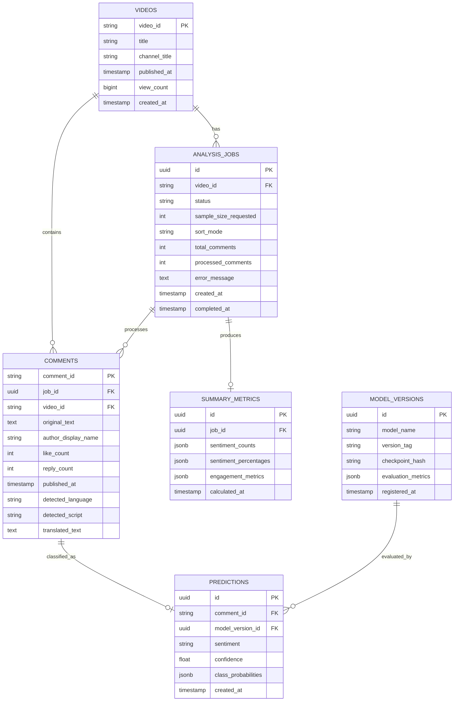

# Database Schema & Migrations — Kollamo.ai

## Database Engine
- Engine: PostgreSQL (14+) / Supabase PostgreSQL
- Access Driver: `asyncpg` with SQLAlchemy 2.0 ORM
- Migration Tool: Alembic

---

## 1. Entity Relationship Diagram



---

## 2. Table Specifications

### `videos`
- `video_id` (VARCHAR(32), Primary Key): YouTube video identifier.
- `title` (VARCHAR(500)): Video title.
- `channel_title` (VARCHAR(255)): Channel name.
- `published_at` (TIMESTAMP WITH TIME ZONE): Publication date.
- `view_count` (BIGINT): Total views at ingestion time.
- `created_at` (TIMESTAMP WITH TIME ZONE): Record creation time.

### `analysis_jobs`
- `id` (UUID, Primary Key, default `uuid_generate_v4()`): Unique job identifier.
- `video_id` (VARCHAR(32), Foreign Key -> `videos.video_id`, Index): Target video.
- `status` (VARCHAR(32), Index): `queued`, `running`, `completed`, `failed`, `cancelled`.
- `sample_size_requested` (INT): Requested comment threshold (e.g., 250, 0 for ALL).
- `sort_mode` (VARCHAR(32)): `top`, `newest`, `oldest`.
- `total_comments` (INT, default 0): Total count discovered.
- `processed_comments` (INT, default 0): Comments completed through the pipeline.
- `error_message` (TEXT, Nullable): Diagnostic error log on failure.
- `created_at` (TIMESTAMP WITH TIME ZONE, default `now()`): Queue timestamp.
- `completed_at` (TIMESTAMP WITH TIME ZONE, Nullable): Completion timestamp.

### `comments`
- `comment_id` (VARCHAR(64), Primary Key): YouTube comment thread ID.
- `job_id` (UUID, Foreign Key -> `analysis_jobs.id`, Index): Parent job.
- `video_id` (VARCHAR(32), Foreign Key -> `videos.video_id`, Index): Parent video.
- `original_text` (TEXT): Exact original raw text without alteration.
- `author_display_name` (VARCHAR(255), Nullable): YouTube author name.
- `like_count` (INT, default 0): Likes count.
- `reply_count` (INT, default 0): Replies count.
- `published_at` (TIMESTAMP WITH TIME ZONE): Comment timestamp.
- `detected_language` (VARCHAR(32), Nullable): e.g., `ml`, `en`, `ml-en`.
- `detected_script` (VARCHAR(32), Nullable): `Malayalam`, `Latin`, `Mixed`.
- `translated_text` (TEXT, Nullable): Optional English translation.

### `predictions`
- `id` (UUID, Primary Key): Unique prediction identifier.
- `comment_id` (VARCHAR(64), Foreign Key -> `comments.comment_id`, Index): Target comment.
- `model_version_id` (UUID, Foreign Key -> `model_versions.id`, Index): Model reference.
- `sentiment` (VARCHAR(32), Index): `positive`, `negative`, `neutral`, `mixed`, `unsupported`.
- `confidence` (FLOAT): Softmax probability of top class.
- `class_probabilities` (JSONB): Full probability distribution across all 5 classes.
- `created_at` (TIMESTAMP WITH TIME ZONE, default `now()`): Inference timestamp.

### `summary_metrics`
- `id` (UUID, Primary Key): Summary record ID.
- `job_id` (UUID, Foreign Key -> `analysis_jobs.id`, Unique Index): Target job.
- `sentiment_counts` (JSONB): Counts per sentiment class.
- `sentiment_percentages` (JSONB): Percentage share per sentiment class.
- `engagement_metrics` (JSONB): Aggregate likes and distribution across sentiments.
- `calculated_at` (TIMESTAMP WITH TIME ZONE, default `now()`).

### `model_versions`
- `id` (UUID, Primary Key): Model registry ID.
- `model_name` (VARCHAR(128)): e.g., `muril-base-cased-kollamo`.
- `version_tag` (VARCHAR(64)): e.g., `v1.0.0`.
- `checkpoint_hash` (VARCHAR(128)): SHA256 or Hugging Face revision.
- `evaluation_metrics` (JSONB): Accuracy, Macro F1, Weighted F1, Confusion Matrix.
- `registered_at` (TIMESTAMP WITH TIME ZONE, default `now()`).

---

## 3. Migration Policy
- No manual SQL changes allowed in development or production.
- Generate migrations with Alembic:
  ```bash
  alembic revision --autogenerate -m "describe_change"
  alembic upgrade head
  ```
