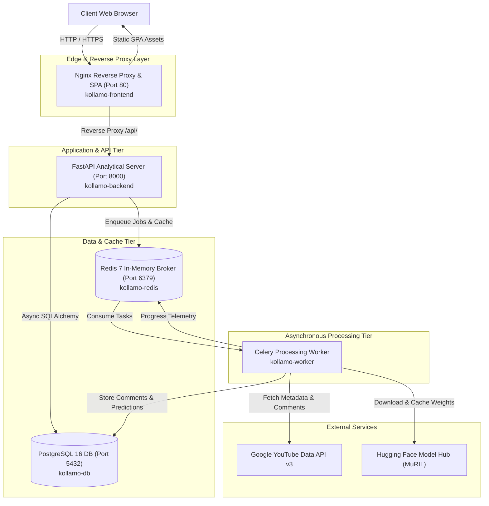

# Production Deployment & Infrastructure Guide — Kollamo.ai

This document provides complete instructions for orchestrating, configuring, deploying, monitoring, and maintaining the Kollamo.ai platform in production environments.

---

## 1. System Architecture Overview



---

## 2. Infrastructure Services Specification

| Service Container | Base Image | Internal Port | Exposed Port | Purpose |
| :--- | :--- | :---: | :---: | :--- |
| `kollamo-frontend` | `nginx:1.27-alpine` | `80` | `80` | High-performance SPA static file server, Gzip compression, and reverse proxy for `/api/`. |
| `kollamo-backend` | `python:3.12-slim` | `8000` | `8000` | FastAPI ASGI server handling sentiment inference, job dispatch, analytics rollups, and reporting. |
| `kollamo-worker` | `python:3.12-slim` | - | - | Celery asynchronous worker pool executing YouTube ingestion, preprocessing, and MuRIL neural inference. |
| `kollamo-db` | `postgres:16-alpine` | `5432` | `5432` | Relational store for videos, jobs, comments, predictions, and summary metrics. |
| `kollamo-redis` | `redis:7-alpine` | `6379` | `6379` | Celery message broker and fast in-memory job telemetry cache. |

---

## 3. Deployment Prerequisites

1. **Hardware Requirements**:
   - **Minimum**: 2 vCPU, 4 GB RAM, 20 GB SSD storage.
   - **Recommended (Production)**: 4 vCPU, 8 GB RAM, 50 GB NVMe SSD storage (recommended for micro-batch neural model caching).
2. **Software Requirements**:
   - Docker Engine >= 24.0.0
   - Docker Compose >= 2.20.0
3. **API Credentials**:
   - Official Google Cloud YouTube Data API v3 key ([Google Cloud Console](https://console.cloud.google.com/)).

---

## 4. Step-by-Step Production Deployment

### 4.1 Clone Repository & Prepare Environment
```bash
git clone https://github.com/org/kollamo-ai.git
cd kollamo-ai

# Copy environment configuration template
cp .env.example .env
```

### 4.2 Configure Environment Variables
Edit `.env` and set secure credentials:
```ini
ENVIRONMENT=production
DEBUG=False
APP_SECRET_KEY=generate_a_64_char_secure_random_string

# PostgreSQL Credentials
POSTGRES_USER=kollamo_admin
POSTGRES_PASSWORD=your_strong_database_password
POSTGRES_DB=kollamo_production

# Ports
BACKEND_PORT=8000
FRONTEND_PORT=80
DB_PORT=5432
REDIS_PORT=6379

# Google YouTube API Key
YOUTUBE_API_KEY=AIzaSy...YourActualGoogleAPIKey

# CORS Settings
ALLOWED_CORS_ORIGINS=http://localhost,https://kollamo.ai,https://app.kollamo.ai
```

### 4.3 Build and Launch Multi-Container Stack
```bash
# Build and launch all five containers in detached mode
docker compose -f docker-compose.prod.yml up -d --build
```

### 4.4 Apply Database Schema Migrations
```bash
# Run Alembic migrations inside the running backend container
docker compose exec backend alembic upgrade head
```

### 4.5 Verify Service Health
```bash
# Verify all container health checks report healthy
docker compose ps

# Test backend health probe
curl -f http://localhost:8000/api/health
```

Expected health response:
```json
{
  "status": "healthy",
  "service": "Kollamo.ai API",
  "version": "1.0.0",
  "environment": "production",
  "database": "connected",
  "redis": "connected",
  "ml_model": "muril-multilingual-v1"
}
```

---

## 5. Maintenance, Backup & Operational Runbook

### 5.1 Database Backup & Restoration

#### Automated Backup:
```bash
# Generate compressed SQL dump of production database
docker compose exec -T db pg_dump -U kollamo_admin -d kollamo_production | gzip > backup_$(date +%Y%m%d_%H%M%S).sql.gz
```

#### Restoration Procedure:
```bash
# Restore from compressed SQL dump
gunzip -c backup_20261007_120000.sql.gz | docker compose exec -T db psql -U kollamo_admin -d kollamo_production
```

### 5.2 Redis Telemetry Persistence
Redis is pre-configured with Append-Only File (`AOF`) persistence. The data volume `redis_prod_data` ensures task state continuity across container restarts.

### 5.3 Scaling Asynchronous Processing
To scale up background worker capacity for heavy comment analysis workloads:
```bash
# Scale Celery workers to 3 parallel container instances
docker compose -f docker-compose.prod.yml up -d --scale worker=3
```

### 5.4 Log Inspection
```bash
# View aggregated real-time logs across all services
docker compose logs -f

# View backend API logs
docker compose logs -f backend

# View Celery worker task execution logs
docker compose logs -f worker
```

---

## 6. Troubleshooting Common Issues

| Issue | Root Cause | Solution |
| :--- | :--- | :--- |
| `DB connection timeout` | PostgreSQL container is still initializing. | Check `docker compose logs db`. Ensure `depends_on` includes `condition: service_healthy`. |
| `YouTube API quota exceeded` | Exceeded 10,000 units/day free tier limit. | Configure API key rotation or fall back to cached review datasets via demo mode. |
| `Worker OOM / killed` | Insufficient container memory for PyTorch weights. | Ensure host has >= 4GB RAM. Increase `deploy.resources.limits.memory` in `docker-compose.prod.yml`. |
| `CORS Error in Browser` | Origin not present in `ALLOWED_CORS_ORIGINS`. | Add frontend domain (e.g. `https://yourdomain.com`) to `ALLOWED_CORS_ORIGINS` in `.env` and restart backend. |
