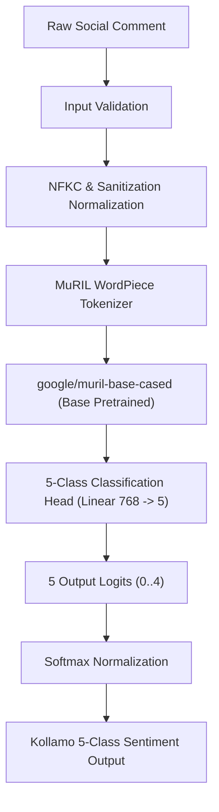

# ML & NLP Pipeline Specification — Kollamo.ai

## 1. Pipeline Overview & Exact MuRIL Checkpoint

The Kollamo.ai machine learning pipeline performs 5-class sentiment classification on regional social media comments containing:
- Pure Malayalam script (`മലയാളം`)
- Manglish / Romanized Malayalam (`adipoli padam`, `valare mosham`)
- Standard English
- Malayalam-English code-mixed expressions (`mass scenes super aayi pakshe climax bore aayi`)

### Official Base Pretrained Model
- **Base Checkpoint**: `google/muril-base-cased` (official Hugging Face repository: [google/muril-base-cased](https://huggingface.co/google/muril-base-cased)).
- **Architecture**: Multilingual BERT-base with 12 layers, 12 attention heads, 768 hidden dimensions, and maximum position length of 512 tokens.
- **Strict Architecture Rule**: `google/muril-base-cased` was pretrained on 17 Indian languages and transliterated data. Substitutions with mBERT, XLM-R, IndicBERT, or generic BERT models are **strictly forbidden**.



---

## 2. Base Model vs. Fine-Tuned Sentiment Model

The base checkpoint `google/muril-base-cased` is **NOT** the finished sentiment model. It is pretrained with Masked Language Modeling and translation pairs, and does not provide 5-class sentiment logits out-of-the-box.

```text
PRETRAINED BASE MODEL
google/muril-base-cased
        │
        │ fine-tune using real 5-class labeled data
        ▼
KOLLAMO SENTIMENT MODEL
kollamo-muril-sentiment-5class
        │
        ├── 0 = Positive
        ├── 1 = Negative
        ├── 2 = Neutral
        ├── 3 = Mixed
        └── 4 = Unsupported
        │
        ▼
ACTUAL KOLLAMO INFERENCE
```

All parameters of `google/muril-base-cased` are trainable and are fine-tuned end-to-end with the 5-class sequence classification head.

---

## 3. Centralized Deterministic Label Mapping

Label ordering is centralized in `ml/models/taxonomy.py` and strictly identical across training, evaluation, schemas, and inference:

| Class ID | Canonical Label | Display Class | Definition Summary |
| :---: | :---: | :---: | :--- |
| **0** | `positive` | **Positive** | Predominantly favorable sentiment, praise, approval, delight. |
| **1** | `negative` | **Negative** | Predominantly unfavorable sentiment, criticism, dissatisfaction. |
| **2** | `neutral` | **Neutral** | Primarily factual, descriptive, informational, queries. |
| **3** | `mixed` | **Mixed** | Materially conflicting positive and negative sentiments in one text. |
| **4** | `unsupported` | **Unsupported** | Non-linguistic noise, spam, empty/symbol text, out-of-scope languages. |

For complete annotation rules, see [docs/annotation-policy.md](./annotation-policy.md).

---

## 4. Preprocessing Guidelines

### Permitted Operations
- **Unicode NFKC Normalization**: Standardizes Dravidian character encodings (chillaksharangal, vowel signs).
- **Whitespace Normalization**: Collapses repeated spaces, tabs, and newlines.
- **URL & Handle Sanitization**: Strips `http[s]://\S+` and `@user_mentions`.
- **Character Repetition Normalization**: Reduces elongated vowel/consonant sequences (e.g. `poliiiiiii` $\rightarrow$ `polii`).
- **Length Capping**: Optional safe truncation to prevent denial-of-service on extreme lengths.

### Strictly Forbidden Operations
- Stripping Malayalam characters or vowel signs.
- Removing negation particles (`illa`, `alla`, `not`, `venda`).
- Hardcoded sentiment dictionaries or keyword lookup rules.
- Automatic full-text translation prior to sentiment inference.

---

## 5. Fine-Tuning Configuration & Reproducibility

Configuration is centralized in `ml/configs/muril_config.yaml`:
- **Base Checkpoint**: `google/muril-base-cased`
- **Fine-Tuned Checkpoint Name**: `kollamo-muril-sentiment-5class`
- **Optimizer**: AdamW (`lr = 2e-5`, `weight_decay = 0.01`).
- **Learning Rate Scheduler**: Linear warmup for 10% of total steps followed by linear decay.
- **Batch Size**: 16.
- **Sequence Length**: 128 tokens (configurable up to 512).
- **Loss Function**: Multi-class Cross-Entropy Loss with balanced class weights.
- **Data Partitioning**: 80% Train, 10% Validation, 10% Test (Held-out).
- **Leakage Prevention**: Assert zero overlapping strings between splits.

---

## 6. Implementation Architecture & Modules

The Phase 2 ML engine is structured into modular Python packages:
- `ml.models.taxonomy`: Centralized deterministic 5-class integer IDs and label mappings.
- `ml.preprocessing.cleaner`: Normalizes Unicode NFKC, cleans URLs/mentions, sanitizes control chars, and reduces repeated characters.
- `ml.preprocessing.detector`: Identifies Malayalam, Latin, Mixed, or Unknown scripts, and classifies linguistic codes (`ml`, `en`, `ml-en`, `unknown`).
- `ml.data.dataset_loader`: Loads corpus splits with 80/10/10 stratification, asserts Zero Data Leakage, and computes class balance percentages.
- `ml.models.baseline_model`: Classical TF-IDF (1,2 n-grams) + Logistic Regression benchmark.
- `ml.models.muril_classifier`: Google MuRIL transformer backbone with 768-dim pooled representations, LayerNorm, Dropout (0.2), and 5-class linear head.
- `ml.models.loader`: Decoupled `ModelLoader` managing weights loading, tokenizer caching, device placement, and predictor lifecycle.
- `ml.exceptions`: Structured exception hierarchy (`ModelLoadingError`, `ModelNotTrainedError`, `InferenceError`, `PreprocessingError`, `ConfigurationError`, `UnsupportedInputError`).
- `ml.training.trainer`: PyTorch training loop with AdamW, linear warmup scheduler, and model checkpointing.
- `ml.evaluation.metrics`: Computes Accuracy, Macro/Weighted F1, Per-class F1, dedicated Mixed and Unsupported evaluations, and 5x5 confusion matrices.
- `ml.evaluation.error_analyzer`: Evaluates model performance across 8 distinct linguistic challenge categories.
- `ml.inference.predictor`: Production-ready prediction wrapper mapping raw comment text to structured sentiment distributions.

---

## 7. Model Loading & Lifecycle Abstraction (`ModelLoader`)

To prevent scatter of Hugging Face / PyTorch instantiation logic, `ModelLoader` encapsulates model initialization:
```python
loader = ModelLoader(
    model_name="google/muril-base-cased",
    weights_path="ml/models/saved_weights/kollamo-muril-sentiment-5class",
    device="cpu", # or 'cuda', 'auto'
    num_classes=5,
)
predictor = loader.get_predictor()
```
- **Untrained Base Guard**: Attempting production inference without a fine-tuned checkpoint raises `ModelNotTrainedError` with status `MODEL_NOT_TRAINED`, preventing fake outputs.
- **Caching**: Reuses initialized tokenizer and neural weights across inference calls.
- **Device Management**: Safely falls back to CPU if CUDA is requested but unavailable.
- **Lifecycle Control**: Supports explicit `unload()` to reclaim system and GPU memory.

---

## 8. Unsupported-Input Policy

Kollamo.ai enforces an explicit policy for unsupported input:
1. **Empty / Null / Non-String Text**: Returns `sentiment="unsupported"`, `confidence=1.0`, and probability 1.0 assigned strictly to the `unsupported` class.
2. **Pure Noise / Non-Linguistic Content**: Comments reduced to empty strings after URL/mention/control character sanitization are mapped to `sentiment="unsupported"`, preserving the raw text for auditability.
3. **Absence of Heuristics**: The system **never** applies hardcoded keyword dictionaries, emoji lookups, or if/else heuristic rules to fabricate sentiment polarity.

---

## 9. Current Limitations & Phase Boundaries

- **Target vs. Actual Accuracy**: Target accuracy goals are design objectives, **never** claimed as current performance without empirical measurement on the complete human-annotated corpus.
- **Model Checkpoints**: Full fine-tuned checkpoints are loaded dynamically via `ModelLoader`. If weights are absent, a fallback baseline is fitted in-memory for testing, or `ModelNotTrainedError` is raised.
- **Phase Boundaries**: Real YouTube scraping (Phase 4), Celery/Redis workers (Phase 5), and frontend-backend wiring (Phase 6) remain decoupled and deferred.
