# ML & NLP Pipeline Specification — Kollamo.ai

## 1. Pipeline Overview

The Kollamo.ai machine learning pipeline is designed specifically for regional social media comments containing:
- Pure Malayalam script (`മലയാളം`)
- Manglish / Romanized Malayalam (`adipoli padam`, `valare mosham`)
- Standard English
- Malayalam-English code-mixed expressions (`mass scenes super aayi pakshe climax bore aayi`)

```mermaid
flowchart LR
    RawText["Raw Comment"]
    Preproc["Safe Preprocessing"]
    Tokenizer["MuRIL WordPiece Tokenizer"]
    MuRILEncoder["MuRIL Encoder (12-layer Transformer)"]
    Pooler["Pooled Representation (CLS / Mean)"]
    DropoutHead["Dropout + Linear Head (768 -> 5)"]
    Softmax["Softmax Layer"]
    Prediction["5-Class Distribution"]

    RawText --> Preproc
    Preproc --> Tokenizer
    Tokenizer --> MuRILEncoder
    MuRILEncoder --> Pooler
    Pooler --> DropoutHead
    DropoutHead --> Softmax
    Softmax --> Prediction
```



---

## 2. Five-Class Taxonomy

1. **`positive`**: Expressions of delight, recommendation, satisfaction, comedy appreciation, or celebration.
2. **`negative`**: Disappointment, harsh criticism, frustration, boredom, or negative review.
3. **`neutral`**: Factual statements, informational questions, release date inquiries, or commentary without emotional polarity.
4. **`mixed`**: Comments exhibiting simultaneous positive and negative opinions (e.g., "acting was great but script was terrible").
5. **`unsupported`**: Irrelevant noise, emojis without context, spam, or unintelligible character sequences.

---

## 3. Preprocessing Guidelines

### Permitted Operations
- **Unicode NFKC Normalization**: Resolves multiple character encodings for Dravidian characters (chillaksharangal, vowel signs).
- **Whitespace Normalization**: Collapses repeated spaces, tabs, and newlines.
- **URL & Handle Sanitization**: Strips `http[s]://\S+` and `@user_mentions`.
- **Character Repetition Normalization**: Reduces elongated vowel/consonant sequences (e.g. `poliiiiiii` -> `polii`, `superrrrr` -> `superr`).

### Strictly Forbidden Operations
- Stripping Malayalam characters or vowel signs.
- Removing negation particles (`illa`, `alla`, `not`, `venda`).
- Hard-coded sentiment dictionaries or keyword lookup rules.
- Automatic full-text translation prior to sentiment inference.

---

## 4. Fine-Tuning Google MuRIL

- **Pretrained Checkpoint**: `google/muril-base-cased` (12 layers, 768 hidden dimensions, 12 attention heads, 110M parameters).
- **Optimizer**: AdamW (`lr = 2e-5`, `weight_decay = 0.01`).
- **Learning Rate Scheduler**: Linear warmup for 10% of total steps followed by cosine annealing.
- **Batch Size**: 16–32 per GPU/process.
- **Sequence Length**: 128 tokens (covers >98% of YouTube comments without truncation).
- **Loss Function**: Cross-Entropy Loss with balanced class weights when distribution asymmetry exceeds 2:1.
- **Checkpointing**: Save top checkpoints based on Validation Macro F1.

---

## 5. Implementation Architecture & Modules

The Phase 2 ML engine is structured into modular Python packages:
- `ml.preprocessing.cleaner`: Normalizes Unicode NFKC, cleans URLs/mentions, sanitizes control chars, and reduces repeated characters.
- `ml.preprocessing.detector`: Identifies Malayalam, Latin, Mixed, or Unknown scripts, and classifies linguistic codes (`ml`, `en`, `ml-en`, `unknown`).
- `ml.data.dataset_loader`: Loads corpus splits with stratification, asserts Zero Data Leakage between splits, and computes balanced class weights.
- `ml.models.baseline_model`: Classical TF-IDF (1,2 n-grams) + Logistic Regression benchmark.
- `ml.models.muril_classifier`: Google MuRIL transformer backbone with 768-dim pooled representations, LayerNorm, Dropout (0.2), and 5-class linear head.
- `ml.models.loader`: Decoupled `ModelLoader` managing weights loading, tokenizer caching, device placement, and predictor lifecycle.
- `ml.exceptions`: Structured exception hierarchy (`ModelLoadingError`, `InferenceError`, `PreprocessingError`, `ConfigurationError`, `UnsupportedInputError`).
- `ml.training.trainer`: PyTorch training loop with AdamW, linear warmup scheduler, and model checkpointing.
- `ml.evaluation.metrics`: Computes Accuracy, Macro/Weighted F1, Per-class F1, and 5x5 confusion matrices.
- `ml.evaluation.error_analyzer`: Evaluates model performance across 8 distinct linguistic challenge categories.
- `ml.inference.predictor`: Production-ready prediction wrapper mapping raw comment text to structured sentiment distributions.

---

## 6. Model Loading & Lifecycle Abstraction (`ModelLoader`)

To prevent scatter of Hugging Face / PyTorch instantiation logic, `ModelLoader` encapsulates model initialization:
```python
loader = ModelLoader(
    model_name="google/muril-base-cased",
    weights_path="ml/models/saved_weights/muril_classifier.pt",
    device="cpu", # or 'cuda', 'auto'
    num_classes=5,
)
predictor = loader.get_predictor()
```
- **Caching**: Reuses initialized tokenizer and neural weights across inference calls.
- **Device Management**: Safely falls back to CPU if CUDA is requested but unavailable.
- **Lifecycle Control**: Supports explicit `unload()` to reclaim system and GPU memory.

---

## 7. Unsupported-Input Policy

Kollamo.ai enforces an explicit policy for unsupported input:
1. **Empty / Null / Non-String Text**: Returns `sentiment="unsupported"`, `confidence=1.0`, and probability 1.0 assigned strictly to the `unsupported` class.
2. **Pure Noise / Non-Linguistic Content**: Comments reduced to empty strings after URL/mention/control character sanitization are mapped to `sentiment="unsupported"`, preserving the raw text for auditability.
3. **Absence of Heuristics**: The system **never** applies hardcoded keyword dictionaries, emoji lookups, or if/else heuristic rules to fabricate sentiment polarity.

---

## 8. Current Limitations & Phase Boundaries

- **Target Accuracy Disclaimer**: Production-grade accuracy cannot be claimed without training on the full human-annotated Malayalam benchmark corpus. The 33.3% empirical baseline is documented in `docs/evaluation.md`.
- **Model Checkpoints**: Full fine-tuned checkpoints are loaded dynamically via `ModelLoader`. If weights are absent, a fallback baseline is fitted in-memory for testing.
- **Phase Boundaries**: Real YouTube scraping (Phase 4), Celery/Redis workers (Phase 5), and frontend-backend wiring (Phase 6) remain decoupled and deferred.

