# ML & NLP Pipeline Specification — Kollamo.ai

## 1. Pipeline Overview

The Kollamo.ai machine learning pipeline is designed specifically for regional social media comments containing:
- Pure Malayalam script (`മലയാളം`)
- Manglish / Romanized Malayalam (`adipoli padam`, `valare mosham`)
- Standard English
- Malayalam-English code-mixed expressions (`mass scenes super aayi pakshe climax bore aayi`)

```mermaid
flowchart LR
    RawText["Raw Comment"]
    Preproc["Safe Preprocessing"]
    Tokenizer["MuRIL WordPiece Tokenizer"]
    MuRILEncoder["MuRIL Encoder (12-layer Transformer)"]
    Pooler["Pooled Representation (CLS / Mean)"]
    DropoutHead["Dropout + Linear Head (768 -> 5)"]
    Softmax["Softmax Layer"]
    Prediction["5-Class Distribution"]

    RawText --> Preproc
    Preproc --> Tokenizer
    Tokenizer --> MuRILEncoder
    MuRILEncoder --> Pooler
    Pooler --> DropoutHead
    DropoutHead --> Softmax
    Softmax --> Prediction
```

---

## 2. Five-Class Taxonomy

1. **`positive`**: Expressions of delight, recommendation, satisfaction, comedy appreciation, or celebration.
2. **`negative`**: Disappointment, harsh criticism, frustration, boredom, or negative review.
3. **`neutral`**: Factual statements, informational questions, release date inquiries, or commentary without emotional polarity.
4. **`mixed`**: Comments exhibiting simultaneous positive and negative opinions (e.g., "acting was great but script was terrible").
5. **`unsupported`**: Irrelevant noise, emojis without context, spam, or unintelligible character sequences.

---

## 3. Preprocessing Guidelines

### Permitted Operations
- **Unicode NFKC Normalization**: Resolves multiple character encodings for Dravidian characters (chillaksharangal, vowel signs).
- **Whitespace Normalization**: Collapses repeated spaces, tabs, and newlines.
- **URL & Handle Sanitization**: Strips `http[s]://\S+` and `@user_mentions`.
- **Character Repetition Normalization**: Reduces elongated vowel/consonant sequences (e.g. `poliiiiiii` -> `polii`, `superrrrr` -> `superr`).

### Strictly Forbidden Operations
- Stripping Malayalam characters or vowel signs.
- Removing negation particles (`illa`, `alla`, `not`, `venda`).
- Hard-coded sentiment dictionaries or keyword lookup rules.
- Automatic full-text translation prior to sentiment inference.

---

## 4. Fine-Tuning Google MuRIL

- **Pretrained Checkpoint**: `google/muril-base-cased` (12 layers, 768 hidden dimensions, 12 attention heads, 110M parameters).
- **Optimizer**: AdamW (`lr = 2e-5`, `weight_decay = 0.01`).
- **Learning Rate Scheduler**: Linear warmup for 10% of total steps followed by cosine annealing.
- **Batch Size**: 16–32 per GPU/process.
- **Sequence Length**: 128 tokens (covers >98% of YouTube comments without truncation).
- **Loss Function**: Cross-Entropy Loss with balanced class weights when distribution asymmetry exceeds 2:1.
- **Checkpointing**: Save top checkpoints based on Validation Macro F1.
