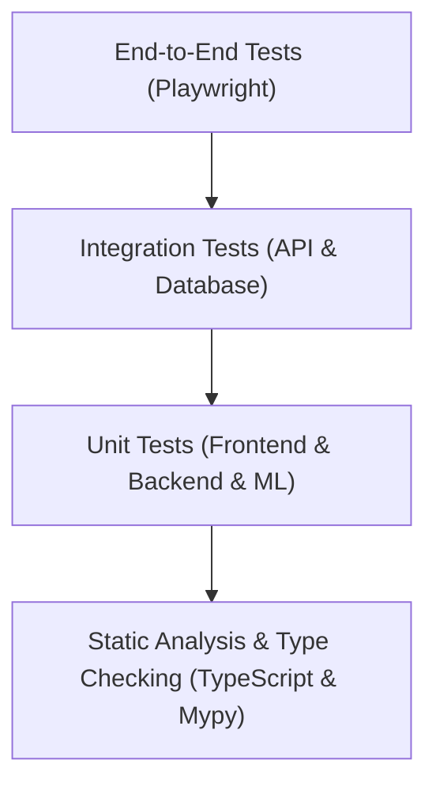

# Testing Strategy & Quality Assurance — Kollamo.ai

## 1. Testing Pyramid

Kollamo.ai enforces a disciplined testing strategy across four levels:

---

## 2. Test Suites by Module

### 2.1 Backend Unit & Integration (`backend/tests/`)
- **Tools**: `pytest`, `pytest-asyncio`, `httpx`.
- **Coverage**:
  - Pydantic schema validation for all endpoints.
  - YouTube Data API v3 client with mocked response fixtures.
  - Celery task execution, retry handlers, and failure recovery.
  - Database repository CRUD operations with rollback fixtures.

### 2.2 Frontend Unit & Component Tests (`frontend/src/__tests__/`)
- **Tools**: Vitest, React Testing Library.
- **Coverage**:
  - Form validation on single-comment sandbox and YouTube URL inputs.
  - State rendering: Loading skeleton, Empty state, Success state, Error state.
  - Sentiment badge and chart accessibility.

### 2.3 ML Pipeline Verification (`ml/tests/`)
- **Tools**: `pytest`.
- **Coverage**:
  - Text cleaner edge cases: Malayalam Unicode normalization, emoji handling, repeated characters.
  - Tokenizer alignment and max sequence length handling.
  - Softmax probability normalization check (probabilities sum to 1.0).
  - Metrics calculation correctness on known confusion matrices.

### 2.4 End-to-End Journeys (Playwright)
- **Journey A**: Home -> Sandbox -> Enter Malayalam/Manglish -> Receive 5-class sentiment & confidence breakdown.
- **Journey B**: Home -> YouTube URL input -> Submit -> Monitor progress panel -> View completed dashboard.
- **Journey C**: Dashboard -> Filter by negative sentiment -> Sort by likes -> Export PDF report.
