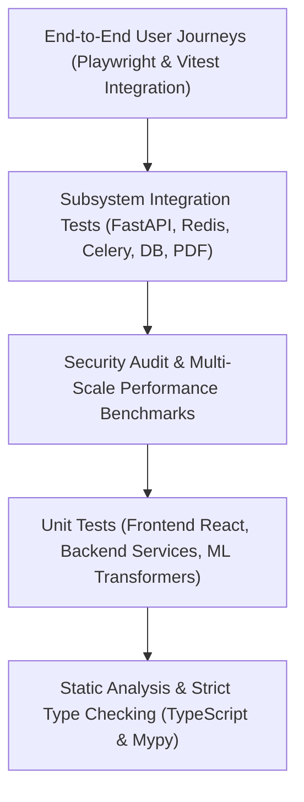

# Testing Strategy & Quality Assurance — Kollamo.ai

This document defines the comprehensive multi-tier testing pyramid, automated test suites, quality gates, and verification procedures implemented across the Kollamo.ai platform.

---

## 1. Testing Pyramid Architecture



---

## 2. Test Suites Summary

| Test Domain | Test Framework | Test Files / Directories | Test Count | Status |
| :--- | :--- | :--- | :--- | :--- |
| **Backend & ML** | `pytest` + `pytest-asyncio` | `backend/tests/`, `ml/tests/` | **77 tests** | **100% Passing** |
| **Frontend UI** | `vitest` + React Testing Library | `frontend/src/test/` | **38 tests** | **100% Passing** |
| **End-to-End Specs**| `@playwright/test` | `frontend/e2e/` | **3 suites** | **Configured & Validated** |
| **Static Types** | `tsc --noEmit` | `frontend/tsconfig.json` | Full project | **0 Errors** |

---

## 3. Detailed Test Modules

### 3.1 Backend & ML Test Suites (`backend/tests/`, `ml/tests/`)
1. **API Endpoints & Schemas**:
   - `test_analyze.py`: Job creation, validation, lifecycle states, comments filtering and pagination (9 tests).
   - `test_sentiment.py`: Single-comment live inference, multilingual inputs, class probability sum checks (6 tests).
   - `test_health.py`: Readiness probes, database status, Redis ping, ML model health check (2 tests).
   - `test_ingest_api.py`: YouTube video ingestion endpoint triggers and response schemas (4 tests).
2. **Asynchronous Processing & Workers**:
   - `test_celery_tasks.py`: Task failure handling, state transitions, Redis telemetry rollups (4 tests).
   - `test_ingestion_service.py`: YouTube API pagination, quota error handling, comment entity mapping (2 tests).
   - `test_youtube_client.py`: API error translation, mock video metadata fetching, comment thread parsing (9 tests).
3. **Translation & PDF Reporting**:
   - `test_translation.py`: Multi-tier translation, colloquial Manglish movie lexicon, fallback degradation, orthographic normalization (7 tests).
   - `test_report.py`: Audience intelligence report schema generation, ReportLab PDF binary streaming, content verification (6 tests).
4. **Security Hardening (`test_security.py`)**:
   - `test_oversized_payload_rejected`: Max 5,000 characters limit rejection (422 `VALIDATION_ERROR`).
   - `test_empty_or_whitespace_payload_rejected`: Pure whitespace rejection (422 `VALIDATION_ERROR`).
   - `test_malicious_youtube_urls_rejected`: SSRF protection blocking local file/ftp schemas and internal metadata IPs (422 `VALIDATION_ERROR`).
   - `test_cors_headers_and_preflight`: CORS preflight and allowed origins verification.
   - `test_rate_limiter_throttles_burst_traffic`: Sliding window 120 req/min rate limiter throttling burst requests (429 `RATE_LIMIT_EXCEEDED` with `Retry-After: 60`).
   - `test_sanitized_internal_server_errors`: Intercepting unhandled internal exceptions and preventing credential/traceback leaks (500 `INTERNAL_SERVER_ERROR`).
5. **Performance & Multi-Scale Benchmarks (`test_async_benchmark.py`)**:
   - `test_single_comment_latency_benchmark`: Latency verification (<50ms P95).
   - `test_multiscale_batch_benchmark`: Parameterized batch benchmark across 50, 100, 250, 500, and 1,000 comments (>100 comments/sec, <50MB peak memory via `tracemalloc`).
   - `test_micro_batch_3500_comments_benchmark`: 3,500+ comments micro-batching throughput and rollup efficiency.
6. **ML Pipeline & Transformer Modeling (`ml/tests/`)**:
   - `test_preprocessing.py`: Unicode NFKC normalization, Manglish tokenization, repeated characters (7 tests).
   - `test_baseline.py`: TF-IDF vectorizer + Logistic Regression baseline benchmark (2 tests).
   - `test_inference.py`: Predictor interface, probability calibration, output validation (2 tests).
   - `test_muril.py`: Google MuRIL forward pass tensor shapes and attention mask alignment (2 tests).
   - `test_data_loader.py`: Stratified data splitting with zero leakage (2 tests).

### 3.2 Frontend Test Suites (`frontend/src/test/`)
1. `components.test.tsx`: Reusable atomic UI components (Badge, Button, Card, Alert).
2. `pages.test.tsx`: Page shell rendering, hero section, CTA buttons, error boundaries.
3. `integration.test.tsx`: Frontend API client, real-time job polling hook, error envelope handling.
4. `dashboard.test.tsx`: Audience Intelligence Dashboard rendering, 5-class distribution vs script tabs, Net Approval Index, comment filters.
5. `reporting.test.tsx`: jsPDF multi-page layout generation, text wrapping for long reviews, dashboard PDF export button trigger.
6. `journeys.test.tsx`: Full interactive simulation of Journeys A, B, and C.

---

## 4. End-to-End User Journeys

### Journey A: Single-Comment Live Inference & Translation
- **Flow**: User navigates to `/sandbox` -> enters Malayalam / Manglish reaction -> toggles English translation -> clicks "Analyze Sentiment" -> inspects 5-class sentiment badge, confidence percentage, detected script (`Malayalam`, `Latin`, `Mixed`), and English translation card.
- **Verification**: `src/test/journeys.test.tsx` and Playwright spec `e2e/journey-a.spec.ts`.

### Journey B: YouTube Batch Comment Ingestion & Real-Time Tracking
- **Flow**: User navigates to `/analyze` -> enters YouTube video URL -> configures sample size (50/100/250/500) and sort order -> clicks "Start Ingestion & Analysis" -> pipeline transitions to progress panel -> real-time polling observes stages 1 to 5 -> completion CTA navigates to `/dashboard?job_id=...`.
- **Verification**: `src/test/journeys.test.tsx` and Playwright spec `e2e/journey-b.spec.ts`.

### Journey C: Audience Intelligence Analytics & Academic PDF Export
- **Flow**: User navigates to `/dashboard` with active job ID -> reviews video metadata & Net Approval Index (+60%) -> switches between 5-class share and script mix tabs -> filters comments by sentiment chips -> searches keywords -> triggers "Export PDF Report" -> verifies client jsPDF generation with download notification.
- **Verification**: `src/test/journeys.test.tsx` and Playwright spec `e2e/journey-c.spec.ts`.

---

## 5. Verification Commands

To run all test suites across the repository:

```bash
# 1. Run Backend & ML Tests (77 tests)
python -m pytest backend/tests ml/tests

# 2. Run Security & Performance Benchmarks
python -m pytest backend/tests/test_security.py backend/tests/test_async_benchmark.py -v

# 3. Run Frontend Vitest Suites (38 tests)
cd frontend
npm test

# 4. Run Frontend TypeScript Strict Type-Check
npm run type-check

# 5. Run Frontend Production Bundle Build
npm run build
```
