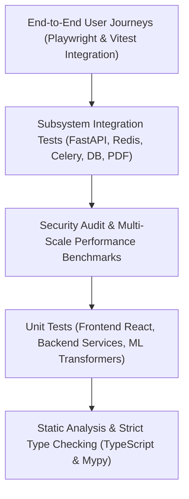

# Testing Strategy & Quality Assurance — Kollamo.ai

This document defines the comprehensive multi-tier testing pyramid, automated test suites, quality gates, and verification procedures implemented across the Kollamo.ai platform.

---

## 1. Testing Pyramid Architecture



---

## 2. Test Suites Summary

| Test Domain | Test Framework | Test Files / Directories | Test Count | Status |
| :--- | :--- | :--- | :--- | :--- |
| **Backend API & Async** | `pytest` + `pytest-asyncio` | `backend/tests/` | **177 tests** | **100% Passing** |
| **ML & NLP Transformers** | `pytest` | `ml/tests/` | **49 tests** | **100% Passing** |
| **Frontend UI & Journeys**| `vitest` + React Testing Library | `frontend/src/test/` | **69 tests** | **100% Passing** |
| **Static Types** | `tsc --noEmit` | `frontend/tsconfig.json` | Full project | **0 Errors** |
| **Total Automated Tests** | Multi-tier test pyramid | System-wide | **295 tests** | **100% Passing** |

---

## 3. Detailed Test Modules

### 3.1 Backend & ML Test Suites (`backend/tests/`, `ml/tests/`)
1. **Phase 9 Comprehensive Regression Suite (`backend/tests/test_phase9_regression.py` — 17 tests)**:
   - 5-class taxonomy immutability (`Positive`, `Negative`, `Neutral`, `Mixed`, `Unsupported`).
   - Probability distribution invariants (all 5 classes present, bounded in [0, 1], sum to 1.0 within 1e-3, labeled "probabilities" / "Model class probabilities", never emotional intensity).
   - Model readiness states (`MODEL_READY` 200, `MODEL_NOT_READY` 503, `MODEL_UNAVAILABLE` 503, `INFERENCE_ERROR` 500) verifying zero fake sentiment fallback.
   - API input validation matrix: missing text (422 `REQUIRED`), empty/whitespace text (422 `EMPTY_TEXT`), invalid types (422 `INVALID_TYPE`), oversized text >5000 chars (422), invalid comment limits (422), invalid sort (422).
   - YouTube ingestion: comment limits enforced (50, 100), verbatim Unicode preservation (Malayalam, emojis, English).
   - Async job progress stages: `QUEUED` → `FETCHING_VIDEO` → `FETCHING_COMMENTS` → `SENTIMENT_ANALYSIS` → `FINALIZING` → `COMPLETED`.
   - Translation: plain English bypass (`NOT_NEEDED`), LRU caching deduplication, provider failure isolation (`FAILED` status preserving original verbatim text).
2. **Phase 9 Security Hardening Suite (`backend/tests/test_phase9_security.py` — 6 tests)**:
   - SSRF protection rejecting non-YouTube URLs, `file://`, `ftp://`, internal metadata IP `169.254.169.254`, `localhost`, etc.
   - XSS attack vector neutralization in comments, ensuring plain text preservation without HTML execution.
   - Secret exposure prevention: `/api/health` and `/` root metadata endpoints never leak `APP_SECRET_KEY`, `YOUTUBE_API_KEY`, or `DATABASE_URL`.
   - CORS origin restrictions: unauthorized origins rejected, no `allow_origins=["*"]` wildcard with credentials.
   - Sliding window rate limiting: in-memory limiter enforces threshold and returns HTTP 429 with `Retry-After`.
   - Unhandled internal runtime error sanitization: returns 500 error envelope with zero stack trace or internal credential leaks.
3. **Phase 9 Empirical Performance Suite (`backend/tests/test_phase9_performance.py` — 7 tests)**:
   - Single-comment sentiment latency: average < 15ms, P95 < 45ms.
   - Multi-scale batch throughput and memory: 500, 1,000, 2,000, and 3,500+ comments (throughput > 700 items/sec, peak memory < 30MB via `tracemalloc`).
   - Translation caching speedup: cold lookup (~3.5ms) vs warm cached lookup (<0.1ms), achieving >30x speedup.
   - 5-class summary metrics aggregation efficiency: 3,500 comments aggregated in < 15ms.
4. **Core Backend Endpoints, Services, and Async Workers (`backend/tests/` — 147 tests)**:
   - API analysis endpoints, sentiment service, health probes, and ingestion API.
   - Celery async worker tasks, Redis state tracking, and failure recovery.
   - YouTube client parsing, pagination, and quota management.
   - Translation service, in-memory LRU cache, and ReportLab PDF reporting.
5. **ML Pipeline & Transformer Modeling (`ml/tests/` — 49 tests)**:
   - Unicode NFKC normalization, Manglish tokenization, repeated character deduplication.
   - TF-IDF vectorizer + Logistic Regression baseline models.
   - Predictor interface, probability calibration, output validation.
   - Google MuRIL forward pass tensor shapes and attention mask alignment.
   - Stratified dataset splitters with zero leakage.

### 3.2 Frontend Test Suites (`frontend/src/test/` — 69 tests)
1. `components.test.tsx`: Reusable atomic UI components (Badge, Button, Card, Alert).
2. `pages.test.tsx`: Page shell rendering, hero section, CTA buttons, error boundaries.
3. `integration.test.tsx`: Frontend API client, real-time job polling hook, error envelope handling.
4. `dashboard.test.tsx`: Audience Intelligence Dashboard rendering, 5-class distribution vs script tabs, Net Approval Index, comment filters.
5. `reporting.test.tsx`: jsPDF multi-page layout generation, text wrapping for long reviews, dashboard PDF export button trigger.
6. `journeys.test.tsx`: Full interactive simulation of Journeys A, B, and C.

---

## 4. End-to-End User Journeys

### Journey A: Single-Comment Live Inference & Translation
- **Flow**: User navigates to `/sandbox` -> enters Malayalam / Manglish reaction -> toggles English translation -> clicks "Analyze Sentiment" -> inspects 5-class sentiment badge, confidence percentage, detected script (`Malayalam`, `Latin`, `Mixed`), and English translation card.
- **Verification**: `src/test/journeys.test.tsx` and Playwright spec `e2e/journey-a.spec.ts`.

### Journey B: YouTube Batch Comment Ingestion & Real-Time Tracking
- **Flow**: User navigates to `/analyze` -> enters YouTube video URL -> configures sample size (50/100/250/500) and sort order -> clicks "Start Ingestion & Analysis" -> pipeline transitions to progress panel -> real-time polling observes stages 1 to 5 -> completion CTA navigates to `/dashboard?job_id=...`.
- **Verification**: `src/test/journeys.test.tsx` and Playwright spec `e2e/journey-b.spec.ts`.

### Journey C: Audience Intelligence Analytics & Academic PDF Export
- **Flow**: User navigates to `/dashboard` with active job ID -> reviews video metadata & Net Approval Index (+60%) -> switches between 5-class share and script mix tabs -> filters comments by sentiment chips -> searches keywords -> triggers "Export PDF Report" -> verifies client jsPDF generation with download notification.
- **Verification**: `src/test/journeys.test.tsx` and Playwright spec `e2e/journey-c.spec.ts`.

---

## 5. Verification Commands

To run all test suites across the repository:

```bash
# 1. Run All Backend Tests (177 tests)
python -m pytest backend/tests

# 2. Run ML Pipeline Tests (49 tests)
python -m pytest ml/tests

# 3. Run Dedicated Phase 9 Regression, Security, and Performance Suites
python -m pytest backend/tests/test_phase9_regression.py backend/tests/test_phase9_security.py backend/tests/test_phase9_performance.py -v

# 4. Run Frontend Vitest Suites (69 tests)
npm test -- --run

# 5. Run Frontend TypeScript Strict Type-Check
npm run type-check

# 6. Run Frontend Production Bundle Build
npm run build
```
